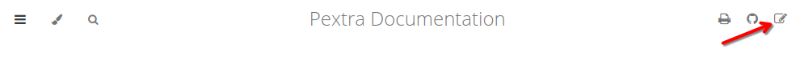
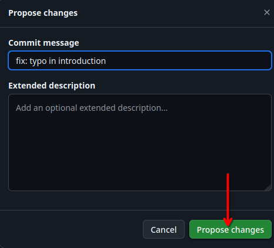
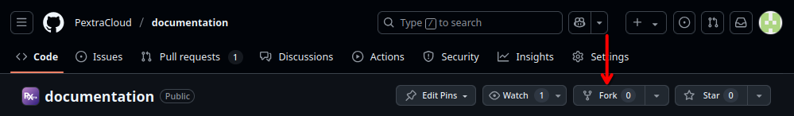
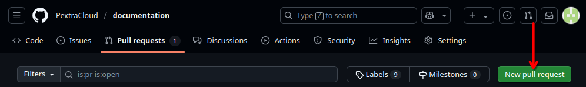

# Contributing
We welcome contributions to our documentation. Whether you want to fix a typo, add examples, or suggest new topics, your contributions are valuable to us. Below are the guidelines for contributing to our documentation.

## How to Contribute

### One-Click Contribution
1. If you find a typo or want to suggest an improvement, click the notepad with a pencil icon at the top right of the page:
   
   - This will take you to the GitHub page for that file.
   - If you are logged in to GitHub, you can edit the file directly in your browser. If you are not logged in, you will be prompted to log in or create an account.

2. Make your changes in the online editor.

3. Click "Propose changes" to create a pull request (PR) with your changes.
   - Commit your changes with a clear and descriptive commit message. We use [Conventional Commits](https://www.conventionalcommits.org/en/v1.0.0/) for commit messages, so please follow that format:
   

4. Wait for feedback from the maintainers. They may request changes or approve your PR. Once approved, your changes will be merged into the main repository.

5. Celebrate your contribution!

### Full Development Setup
1. [Create a GitHub account](https://github.com/signup) if you don't have one.

2. Fork the repository by clicking the "Fork" button at the top right of the page:
   

3. Clone your forked repository to your local machine:
   ```bash
   git clone https://github.com/PextraCloud/documentation.git
   ```

4. Create a new branch for your changes:
   ```bash
   git switch -c <name>/<feature>
   ```

5. Set up your development environment:
   - Install the necessary dependencies.
   - Follow the instructions in the repository's README for setting up your local environment.

6. Make your changes to the documentation files.
   - Use Markdown for formatting.
   - Follow the existing style and structure of the documentation.

7. Commit your changes with a clear and descriptive commit message. We use [Conventional Commits](https://www.conventionalcommits.org/en/v1.0.0/) for commit messages, so please follow that format:
   ```bash
   git add .
   git commit -m "fix: correct typo in installation guide"
   ```

8. Push your changes to your forked repository:
   ```bash
   git push origin <name>/<feature>
   ```

9. Create a pull request (PR) to the main repository:
   
   - Navigate to [the original documentation repository](https://github.com/PextraCloud/documentation).
   - Click on the "Pull Requests" tab.
   - Click on "New Pull Request."
   - Select your branch and click "Create Pull Request."
   - Provide a clear description of your changes and why they are needed.

10. Wait for feedback from the maintainers. They may request changes or approve your PR. Once approved, your changes will be merged into the main repository.

11. Celebrate your contribution!