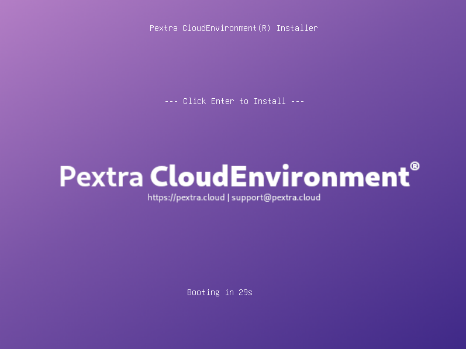

# Booting from the Installation Media
1. Insert the bootable USB drive or DVD into the server.
2. Power on the server and enter the BIOS/UEFI settings (usually by pressing `F2`, `F10`, or `DEL` during startup).
3. Change the boot order to prioritize the USB drive or DVD.
4. Save the changes and exit the BIOS/UEFI settings.
5. The server should boot from the installation media, and you will see the bootloader screen:
   

Press the `Enter` key to start the installation process. You can now proceed with the installation steps.