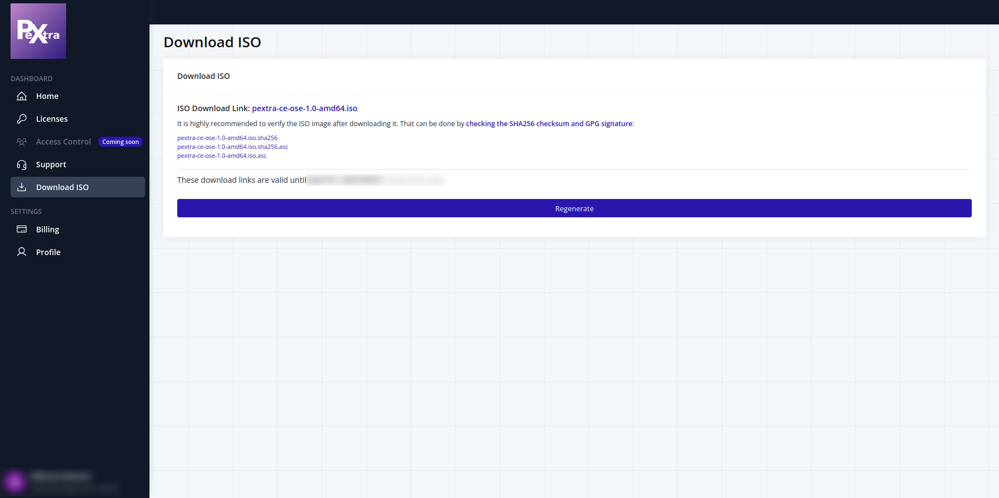

# Downloading the Installer
> [!NOTE]
> The ISO file is approximately 2 GB in size. Make sure you have enough disk space before downloading, and a stable internet connection to avoid download interruptions.

1. Log into the [Pextra Customer Portal](https://portal.pextra.cloud).

2. Click on "Download ISO", then click on "Generate" to generate download links for the latest version of Pextra CloudEnvironment®:
   

3. Click on the download link to download the ISO file.

After the download is complete, it is strongly recommended to [verify the integrity of the downloaded ISO file](./verifying.md) using the SHA256 and GPG signatures provided on the download page.