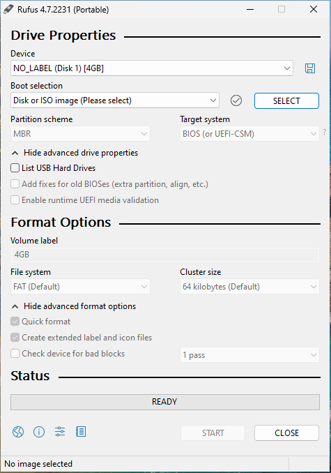
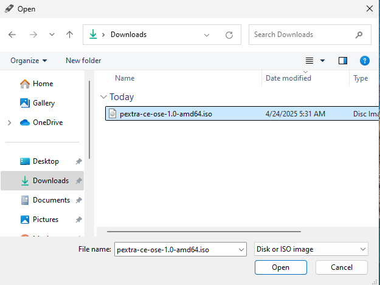
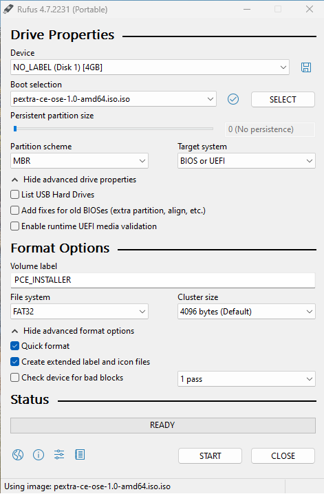
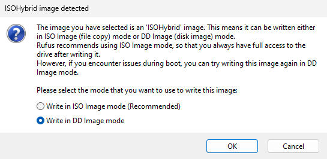
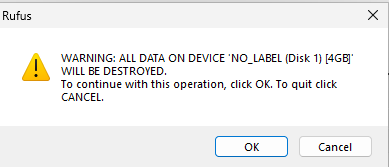
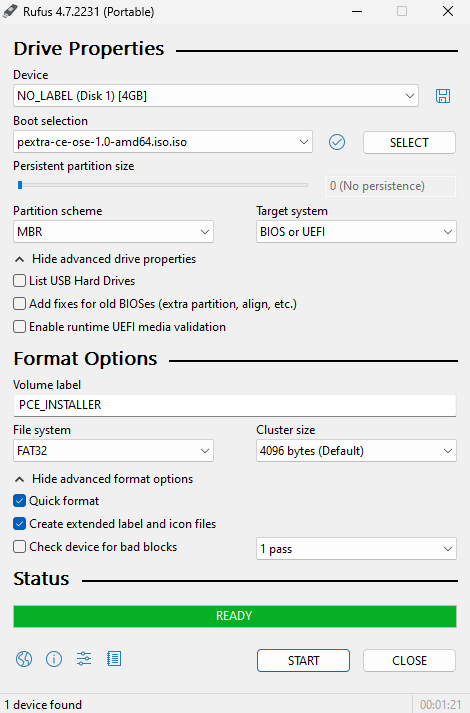

# Preparing Installation Media
Now that you have downloaded the ISO installer, you need to create a bootable USB drive or DVD. Follow the instructions below for your operating system to create the installation media.

> [!WARNING]
> Creating a bootable USB drive will erase all data on the selected drive. Make sure to back up any important data before proceeding.

## Linux
Linux users can use the `dd` command to create a bootable USB drive. `dd` is a built-in command and does not require any additional software.

1. Insert a USB drive with at least 8GB of space. Make sure to back up any important data on the drive, as it will be formatted.
2. Open a terminal and run the command `lsblk` to identify the device name of the USB drive (e.g., `/dev/sdX`, where `X` is the letter assigned to your USB drive).
3. Unmount the USB drive using the command (you may need to use `sudo`):
   ```bash
	umount /dev/sdX*
   ```
4. Use the `dd` command to create a bootable USB drive. Replace `/path/to/pextra-ce.iso` with the path to the downloaded ISO file and `/dev/sdX` with the device name of your USB drive (e.g., `/dev/sdb`):
   ```bash
   dd if=/path/to/pextra-ce.iso of=/dev/sdX bs=4M status=progress
   ```
5. After the process is complete, run the following command to ensure all data is written to the USB drive:
   ```bash
   sync
   ```
6. Safely eject the USB drive using the command (you may need to use `sudo`):
   ```bash
   eject /dev/sdX
   ```
Your USB drive is now ready to be used for installation.

## MacOS
MacOS users can also use the `dd` command to create a bootable USB drive. The process is similar to Linux, but with some differences in the commands used.

1. Insert a USB drive with at least 8GB of space. Make sure to back up any important data on the drive, as it will be formatted.
2. Open a terminal and run the command `diskutil list` to identify the device name of the USB drive (e.g., `/dev/diskX`, where `X` is the number assigned to your USB drive).
3. Unmount the USB drive using the command (you may need to use `sudo`):
   ```bash
   diskutil unmountDisk /dev/diskX
   ```
4. Use the `dd` command to create a bootable USB drive. Replace `/path/to/pextra-ce.iso` with the path to the downloaded ISO file and `/dev/diskX` with the device name of your USB drive (e.g., `/dev/disk2`):
   ```bash
   sudo dd if=/path/to/pextra-ce.iso of=/dev/diskX bs=4m status=progress
   ```
5. After the process is complete, run the following command to ensure all data is written to the USB drive:
   ```bash
   sync
   ```
6. Safely eject the USB drive using the command (you may need to use `sudo`):
   ```bash
   diskutil eject /dev/diskX
   ```
Your USB drive is now ready to be used for installation.

## Windows
Windows users can use [Rufus](https://rufus.ie/) in DD mode to create a bootable USB drive, as there is no built-in mechanism to create bootable USB drives from ISO files. Rufus is free and open source software.

1. Download the latest version of [Rufus](https://rufus.ie/) and run it.

2. Insert a USB drive with at least 8GB of space. Make sure to back up any important data on the drive, as it will be formatted. In Rufus, select the USB drive by clicking on the "Device" dropdown menu:

   

3. Select the downloaded ISO file by clicking on the "SELECT" button. Navigate to the location where you saved the ISO file and select it:

   

4. With the USB and ISO ready, the window should similar to this. Click on "START" button to begin the process:

   

5. A pop-up window will appear. Select "Write in DD Image mode" and click "OK":

   

6. Another pop-up window will appear, warning you that all data on the USB drive will be erased. Click "OK" to proceed:

   

7. Once the process is complete, the bar will be green and say "READY". You can close Rufus:

   

8. Safely eject the USB drive from your computer.

Your USB drive is now ready to be used for installation.