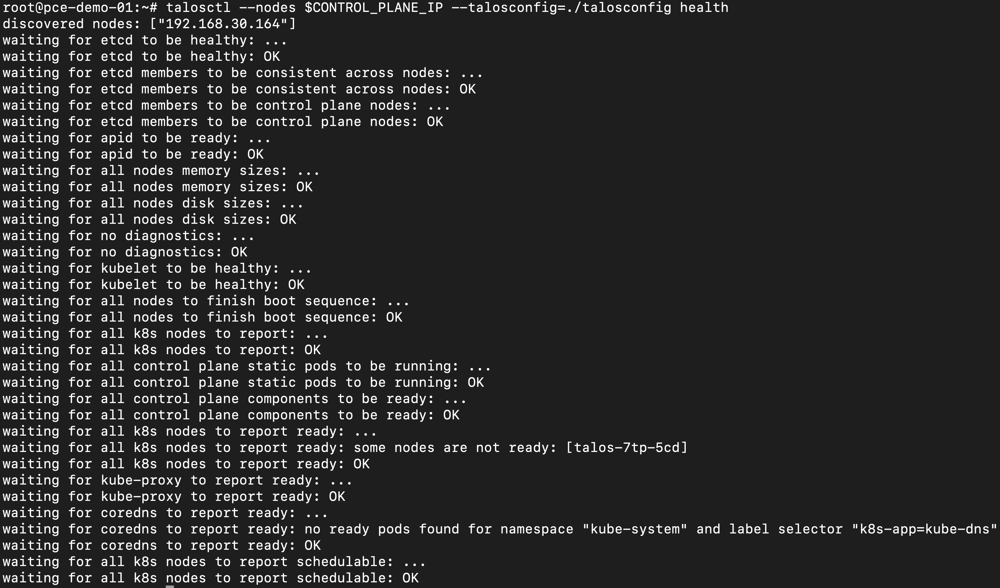
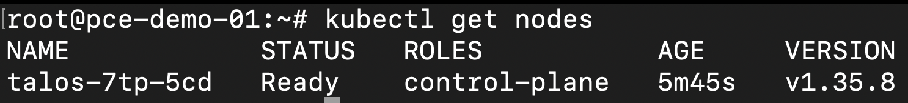

# Bootstrap Cluster and Set Up `kubectl`
Point `talosctl` at the node, then bootstrap:

```bash
talosctl --talosconfig=./talosconfig config endpoints $CONTROL_PLANE_IP
talosctl bootstrap --nodes $CONTROL_PLANE_IP --talosconfig=./talosconfig
```

* `./talosconfig` is the client configuration file generated in [Generate and Apply Cluster Configuration](./generate-config.md).
* `CONTROL_PLANE_IP` is the IP address of the installed Talos node (the same address the maintenance environment had before installation).

> [!NOTE]
> Run `talosctl bootstrap` **only once**, against a single control plane node. Bootstrap initializes the cluster and will fail if it has already been performed.

Verify cluster health:

```bash
talosctl --nodes $CONTROL_PLANE_IP --talosconfig=./talosconfig health
```

Various components should report as `OK`, and the control plane node should be `Healthy`.



## Set up `kubectl` Access
Generate a `kubeconfig` for the cluster. To keep it separate from any existing cluster configuration:

```bash
talosctl kubeconfig pextra-kubeconfig --nodes $CONTROL_PLANE_IP --talosconfig=./talosconfig
export KUBECONFIG=./pextra-kubeconfig
```

Confirm the node is registered:

```bash
kubectl get nodes
```

You should see your node listed as `Ready`.

