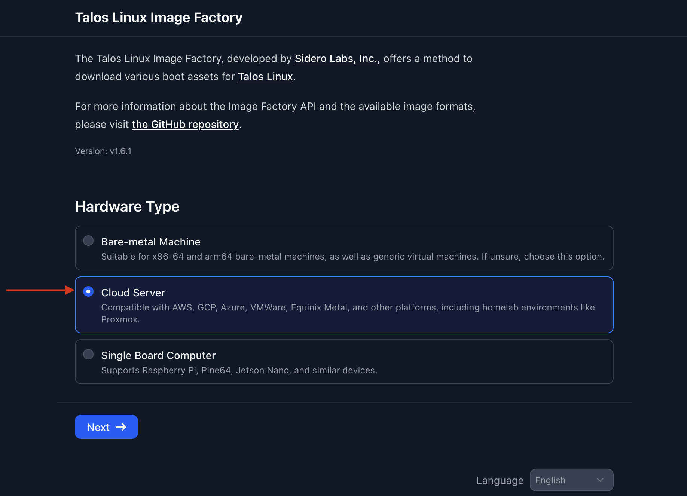
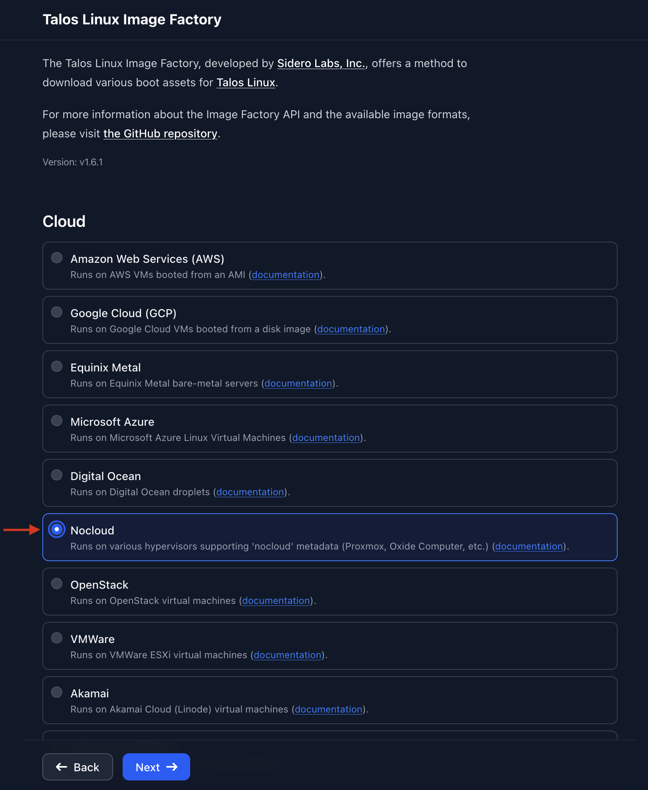
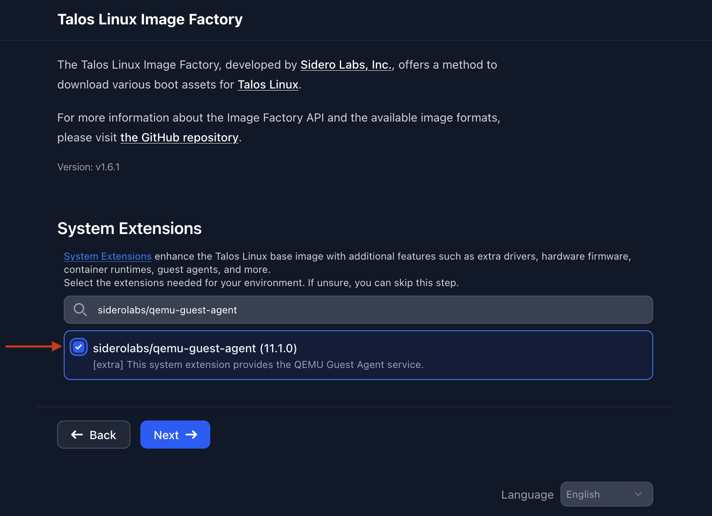
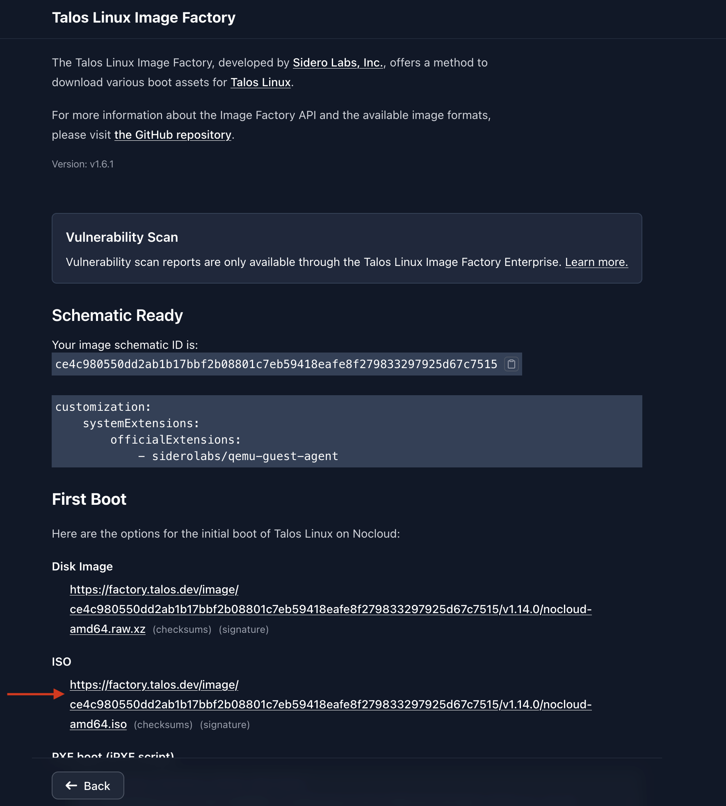
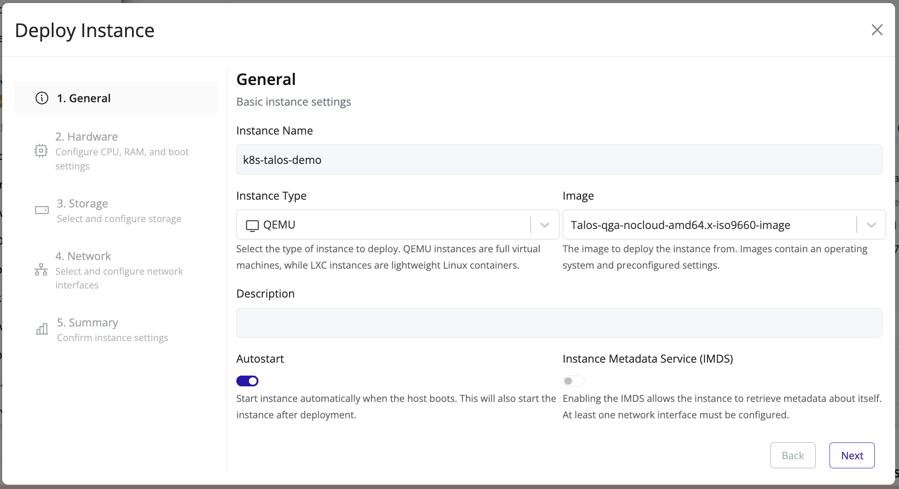
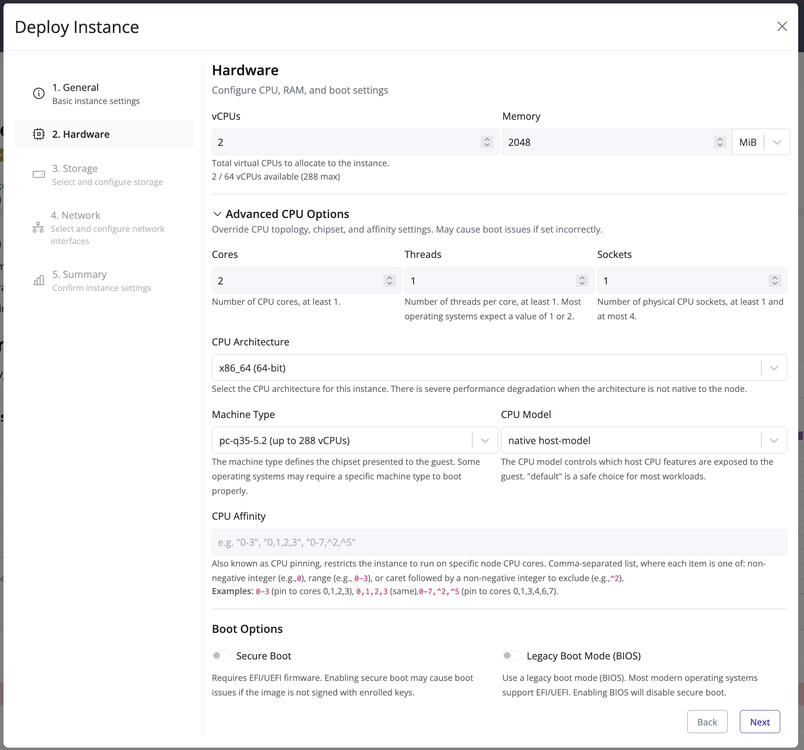
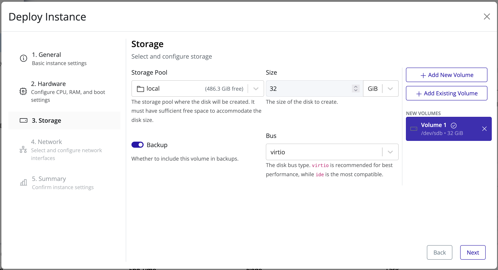
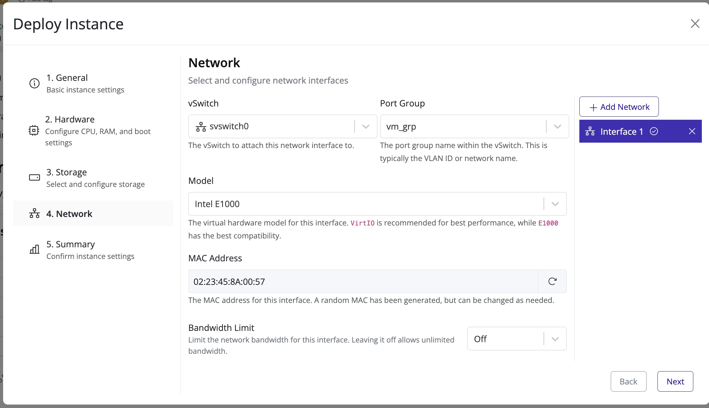
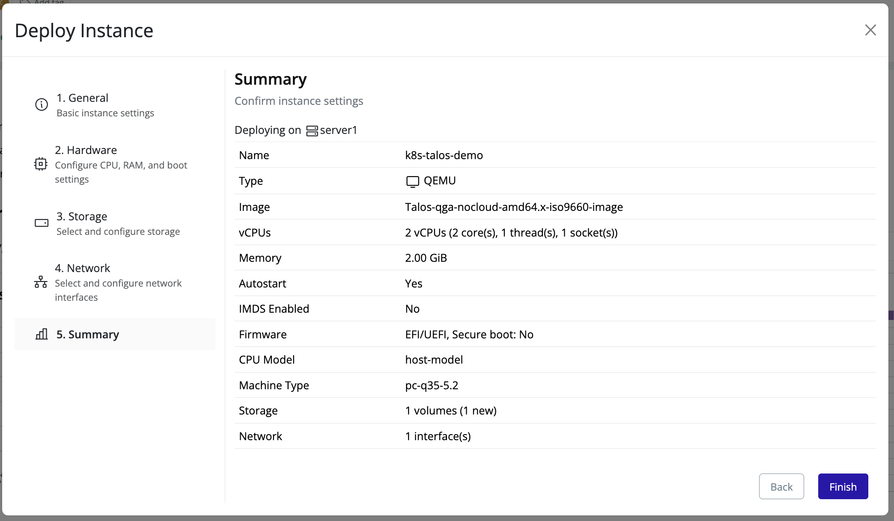

# ISO Download and Deployment

## Download the Talos Linux ISO
1. Open the Talos [Image Factory](https://factory.talos.dev/) in your browser.
   <!-- SCREENSHOT: Image factory landing page with a Talos ISO generation form -->
2. Configure the image:
   * **Hardware type:** select **Cloud Server**.

   

   * **Version:** keep the default, which is the latest stable release.
   * **Cloud:** select **Nocloud**.

   

   * **Architecture:** choose `amd64` (the default) or `arm64`, matching the architecture of the Pextra CloudEnvironment® servers you will deploy to.
   * **System extensions:** optionally add `siderolabs/qemu-guest-agent` if you want the QEMU guest agent enabled on the Talos nodes.

   

   * Leave the remaining customization options at their defaults, unless you have a specific reason to change them.
3. Generate the image and **download the ISO**.
   
4. Upload the ISO to Pextra CloudEnvironment®.

## Deploy the Talos ISO
>[!WARNING]
>The default CPU model (`default`) is **not sufficient for Talos** and *will* result in a bootloop. If Talos fails to boot into its maintenance environment and repeatedly restarts, first check that the CPU model is set to **`host-model`**.

1. Right-click the target node and select **Deploy**.
2. Fill in the instance name (for example, `k8s-talos-demo`), set the instance type to **QEMU**, and image to the Talos ISO you downloaded above. Click **Next**.
   
3. Set at least two vCPUs, and 2GiB of RAM (refer to the [Talos documentation](https://docs.siderolabs.com/talos/v1.13/getting-started/system-requirements) for resource requirements).
4. Expand **Advanced CPU Options**. Set the **machine type** to a `q35` variant (for example, `q35-5.2`) and the **CPU model** to **`host-model`**. Click **Next**.
   
5. Attach a disk with at least 10 GiB of storage. Talos installs the complete operating system and Kubernetes components to this disk. Click **Next**.
   
6. Attach a network interface to a vSwitch that has access to the internet, with DHCP enabled. This allows the Talos maintenance environment to obtain an IP address for configuration. Click **Next**.
   
7. Confirm the configuration and click **Finish**. Wait for the instance to start.
   

## Next Steps
Proceed to [Prepare the Talos node](./prepare-node.md).
