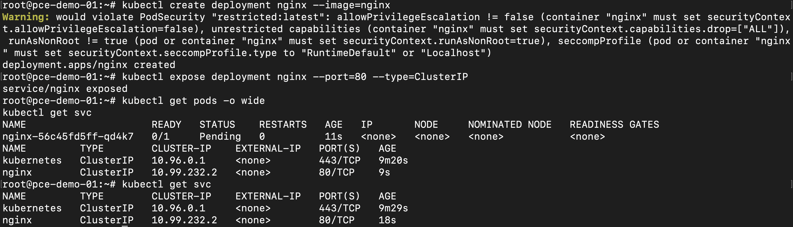

# Deploy Test Workload
Deploy a small nginx deployment with a `ClusterIP` Service to confirm the cluster can schedule and serve workloads:

```bash
kubectl create deployment nginx --image=nginx
kubectl expose deployment nginx --port=80 --type=ClusterIP
```

Check the results:

```bash
kubectl get pods -o wide
kubectl get svc
```



Congratulations! You have a working Kubernetes cluster with a scheduled workload on Talos Linux running on Pextra CloudEnvironment®. You can now use `kubectl` to manage the cluster and deploy additional workloads.

## Next Steps

* To plan a more resilient deployment (worker nodes, multiple control plane nodes, etcd quorum, load balancing), see the [Talos production notes](https://docs.siderolabs.com/talos/latest/getting-started/prodnotes).
* The full [Talos getting-started guide](https://docs.siderolabs.com/talos/latest/getting-started/getting-started) covers additional scenarios in depth.
