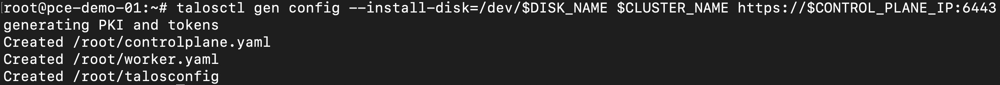
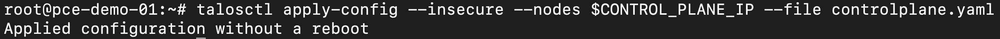

# Generate and Apply Cluster Configuration
Talos nodes are configured entirely with declarative YAML files. Run `talosctl gen config` on your workstation to generate the machine configurations:

```bash
export CLUSTER_NAME=<cluster_name>
export DISK_NAME=<control_plane_disk_name>

talosctl gen config --install-disk=/dev/$DISK_NAME $CLUSTER_NAME https://$CONTROL_PLANE_IP:6443
```

* `CLUSTER_NAME` is the name of your cluster, e.g., `k8s-talos-demo`.
* `DISK_NAME` is the disk you identified in [Prepare Talos Node](./prepare-node.md) (typically `vda`).
* `CONTROL_PLANE_IP` is the maintenance environment IP address you exported in [Prepare Talos Node](./prepare-node.md).

This produces three files in the current directory:

* **`controlplane.yaml`** - machine configuration for the control plane node.
* **`worker.yaml`** - machine configuration for the worker node(s).
* **`talosconfig`** - client configuration that lets `talosctl` authenticate to the cluster.



For additional flags (for example, configuring a CNI plugin, an external load balancer, or the cluster DNS), see the [`talosctl gen config` reference](https://docs.siderolabs.com/talos/latest/reference/cli/#talosctl-gen-config) in the Talos documentation.

## Apply Machine Configuration
With the node still in its unconfigured (maintenance) state, apply the generated configuration:

```bash
talosctl apply-config --insecure --nodes $CONTROL_PLANE_IP --file controlplane.yaml
```



Once the configuration is applied, Talos begins the installation to the disk you specified and restarts out of the RAM environment. Give it a few minutes; the Talos node will reboot and come back up as an installed Talos system. Check instance state through the Pextra web interface or the console as the nodes reboot.

