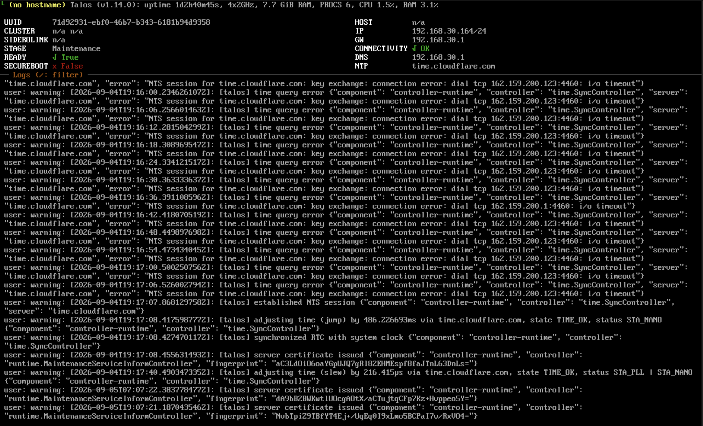
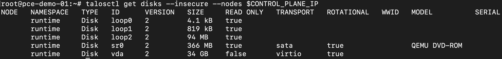

# Prepare the Talos Node
This step involves booting the instance into the Talos maintenance environment (which runs entirely in RAM) and identifying the disk that Talos will install itself to.

## Boot into the Maintenance Environment
1. Open the **Console** tab for the instance. As the image boots, Talos runs entirely in RAM. The VM will **not** install anything to disk yet — that only happens once a machine configuration is applied.
2. Note the IP address that appears on the console. This is the address of the Talos maintenance environment, which you will use to configure the node.
   
3. On your workstation, store the address in an environment variable for later use:
   ```bash
   export CONTROL_PLANE_IP=<IP_ADDRESS_FROM_CONSOLE>
   ```

## Identify the Installation Disks
> [!NOTE]
> At this point, it is recommended to detach the Talos ISO CD-ROM. This prevents Talos from booting into the maintenance environment again after installation. Refer to the [Detach Device](../../user-guide/instance/attaching/detach.md) section to detach the ISO CD-ROM from the instance.

On your workstation, run the following command to list the disks that Talos sees:

```bash
talosctl get disks --insecure --nodes $CONTROL_PLANE_IP
```



The name of the disk you attached in the [Download and Deploy Talos ISO](./deploy-iso.md) step will typically be named `vda`. Make a note of this disk name, as you will need it when generating the machine configuration in the next step.

## Next Steps
Proceed to [Generate and Apply Cluster Configuration](./generate-config.md).