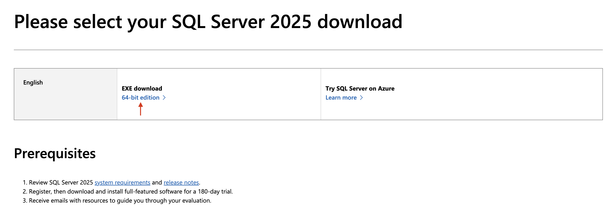
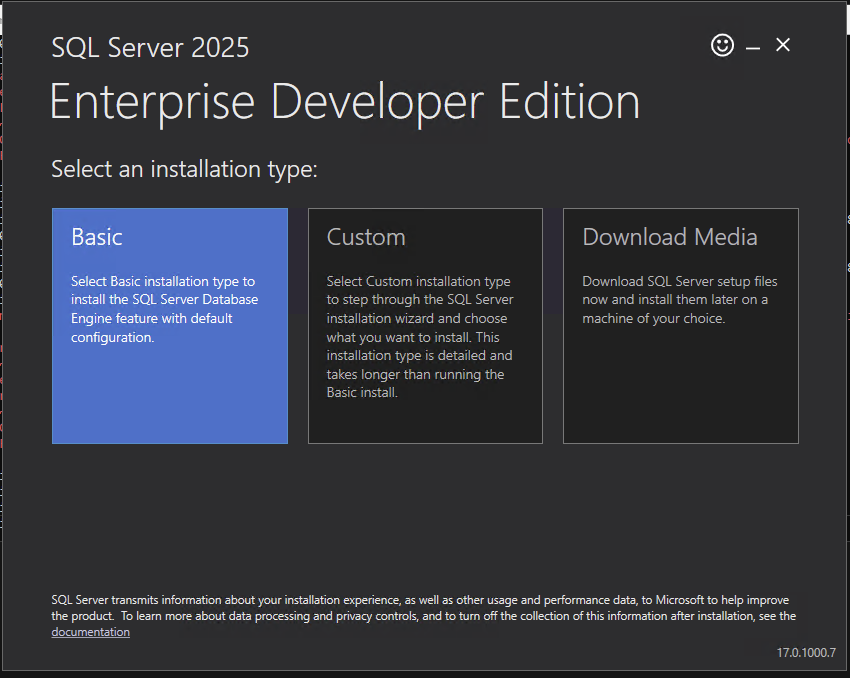
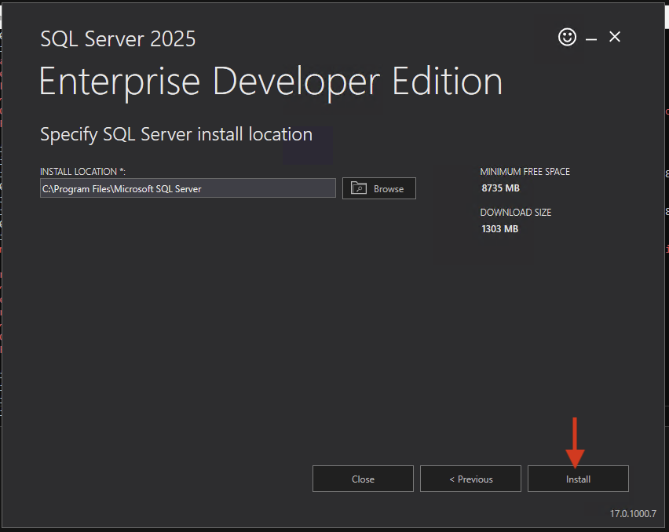

# Install SQL Server 2025
This step installs [SQL Server 2025](https://www.microsoft.com/en-us/sql-server) on the Windows Server 2025 instance.

1. Open the [Microsoft Evaluation Center - SQL Server 2025 Download](https://www.microsoft.com/en-us/evalcenter/sql-server-2025-download) page in your browser. Copy the EXE download link for the 64-bit edition.

   

> [!NOTE]
> The following steps must be run inside the Windows Server 2025 instance.

2. Run the following command to download the SQL Server 2025 installer:
   ```powershell
   $ProgressPreference = 'SilentlyContinue' # Silencing the progress bar speeds up the download significantly
$url = "<Paste EXE link here>"
   Invoke-WebRequest -Uri $url -OutFile "C:\temp\SQLServer2025.exe"
   ```

3. Once the download completes, launch the installer:
   ```powershell
   Start-Process "C:\temp\SQLServer2025.exe"
   ```

4. Select the **Basic Installation** type and click **Next**.

   

5. Accept the license terms and click **Next**.
6. Click **Install** to begin the installation process. This will take some time to complete.

   

Upon installer completion, do not close the installer; proceed to [Verify the SQL Server Installation](./verify-sql-server.md).