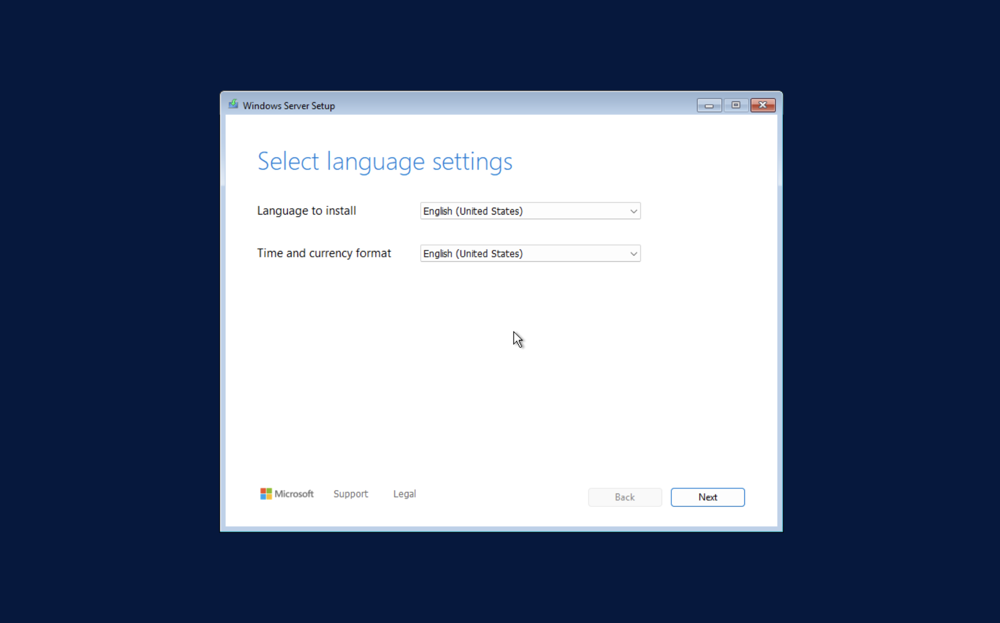
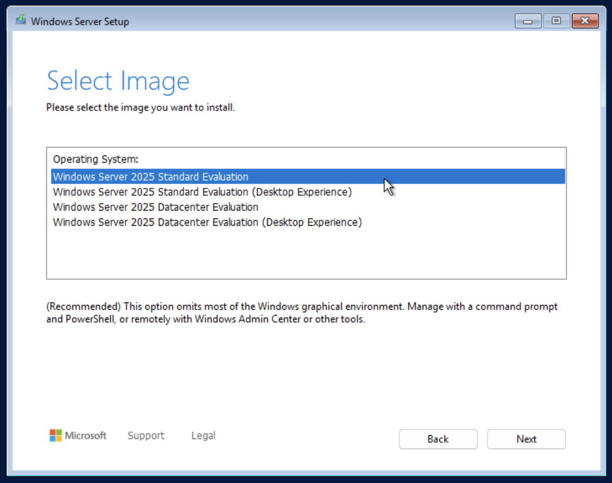
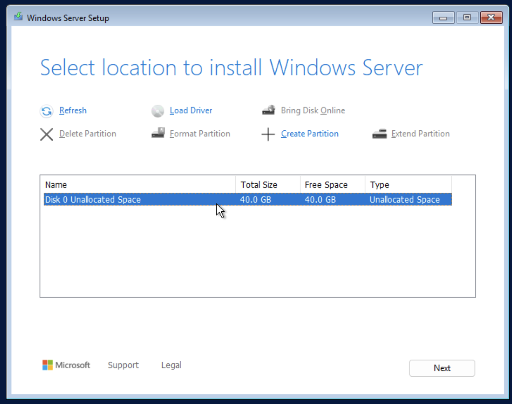
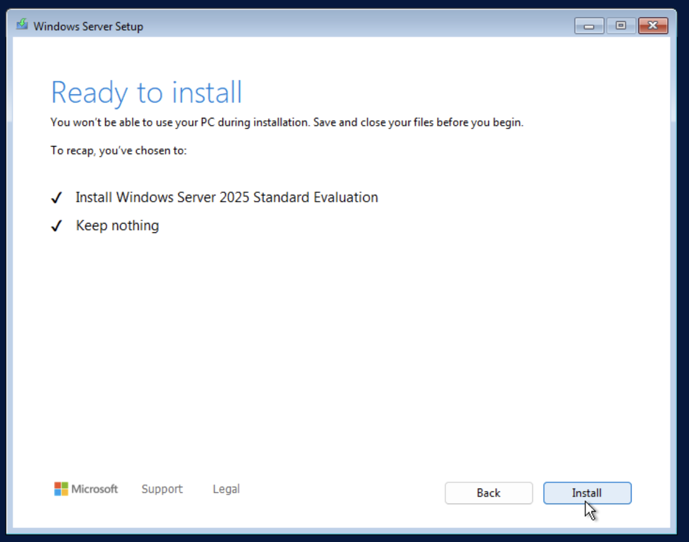
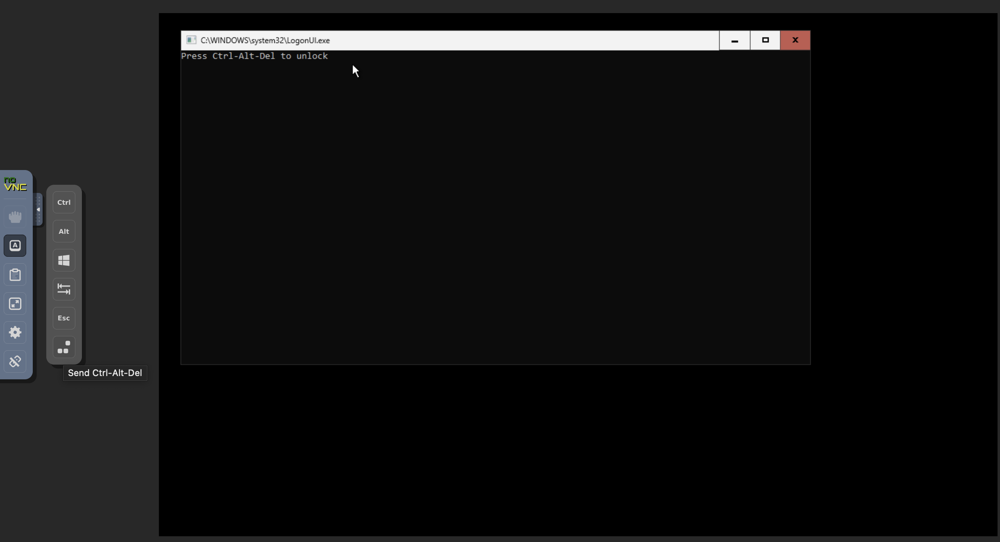
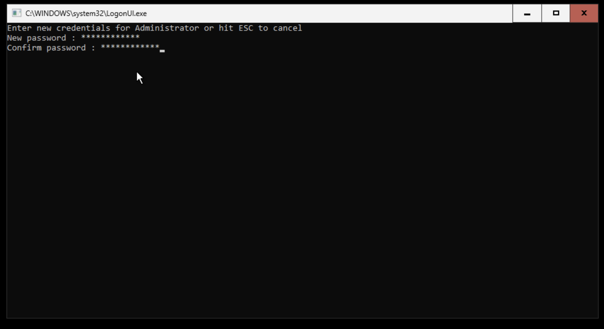
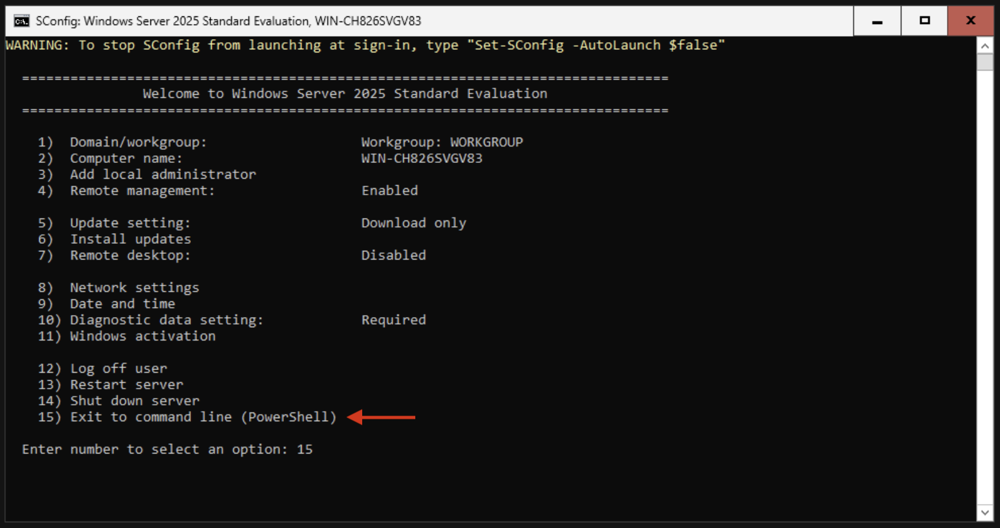

# Install Windows Server 2025
This step installs Windows Server 2025 from the attached ISO CD-ROM into the instance.

## Boot into the Windows Setup
>[!WARNING]
> You must click any key in the console when prompted ("Press any key to boot from cd or dvd..."). Otherwise, the instance will boot to the UEFI firmware interface. You will need to restart the instance to try again.

1. Open the **Console** tab for the instance. As the image boots, the Windows Server setup program (Windows Setup) appears.

   

2. Proceed through the initial steps of the Windows Setup, including accepting the EULA. When asked to select the image, select **Windows Server 2025 Standard Edition**. Click **Next**.

   

3. When prompted to select the installation disk, select the disk you attached in the [Prepare Windows Server](./prepare-windows.md) step.

   

4. Click **Install** to begin the installation process. This will take some time to complete. Once installed, the instance will automatically restart.

   

> [!NOTE]
> It is recommended to detach the Windows Server ISO CD-ROM at this point. This prevents the instance from booting back into the installer after a reboot. Refer to the [Detach Device](../../user-guide/instance/attaching/detach.md) section to detach the ISO CD-ROM from the instance. Verify the instance boots from disk by [restarting](../../user-guide/instance/states/restart.md) it and watching the console.

5. Click the Ctrl-Alt-Del button in the console.

   

6. Once prompted, set the password for the Administrator account when prompted.

   

7. After setting the password, you will be asked to send diagnostic and usage data to Microsoft. Choose your preferred option and continue. `SConfig.exe` will launch automatically. Enter the **Exit to command line (PowerShell)** option to return to the command line.

   

For additional details on installation options, refer to the [Windows Server documentation](https://learn.microsoft.com/en-us/windows-server/get-started/).

> [!TIP]
> For a smoother console experience, it is recommended to [enable Remote Desktop](https://learn.microsoft.com/en-us/windows-server/remote/remote-desktop-services/remotepc/remote-desktop-allow-access) and connect with a Remote Desktop Protocol (RDP) client.

## Next Steps
Proceed to [Install SQL Server 2025](./install-sql-server.md).