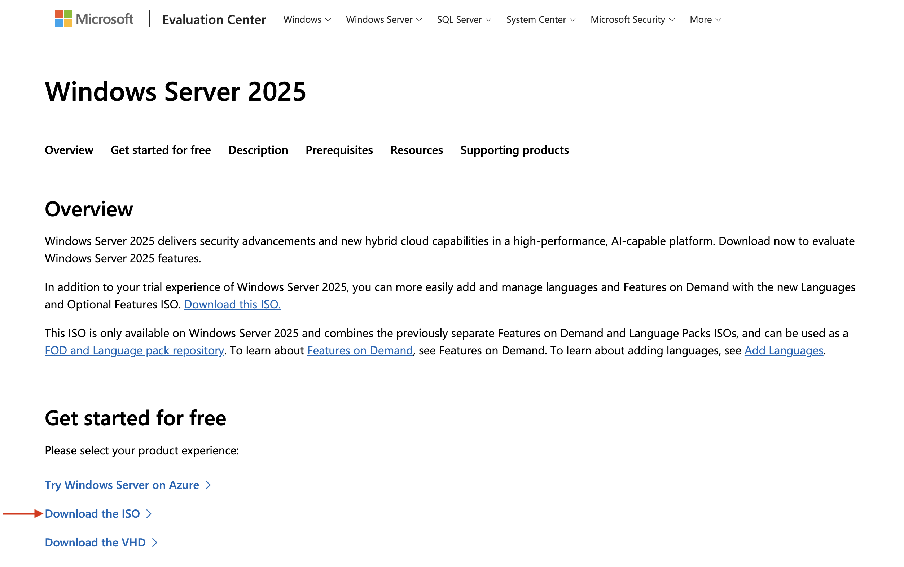
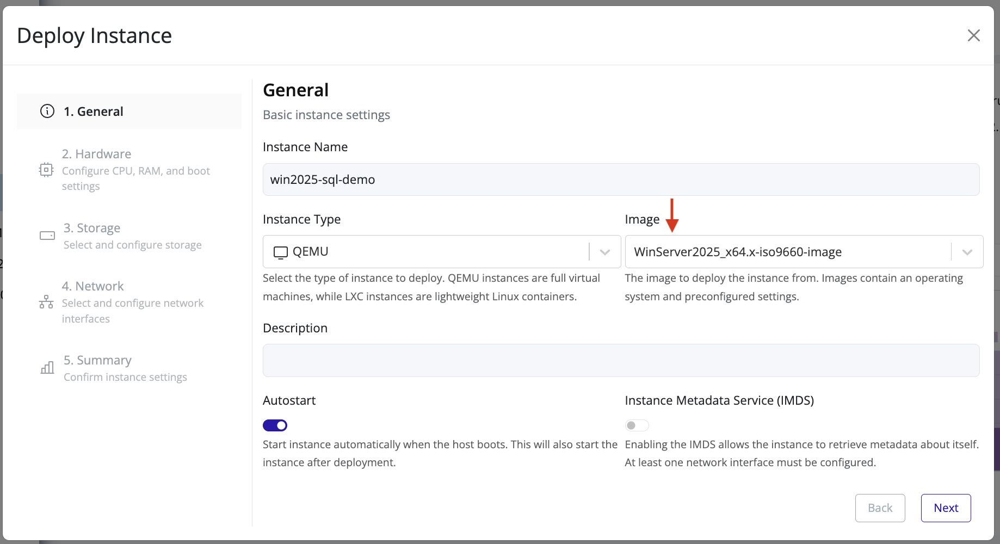
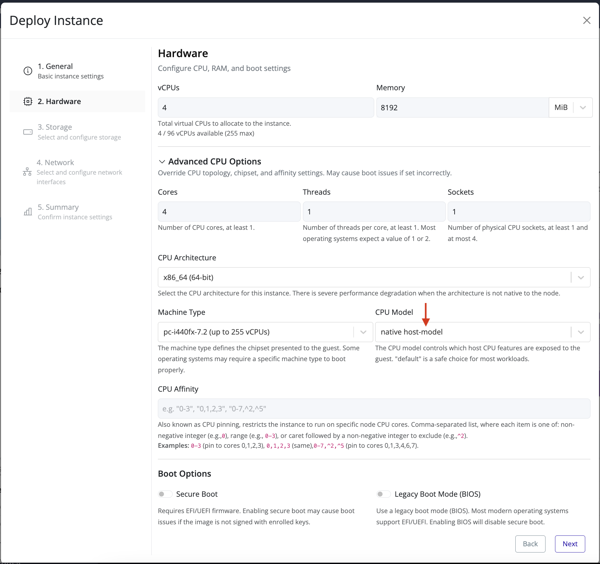
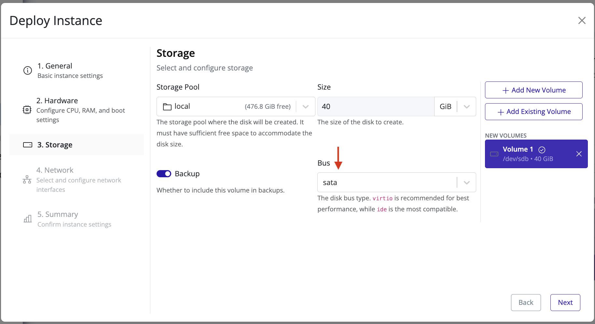
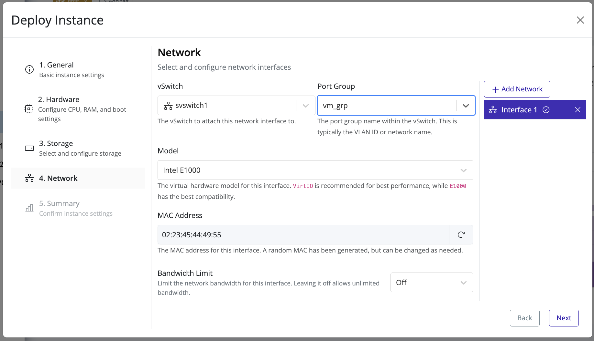
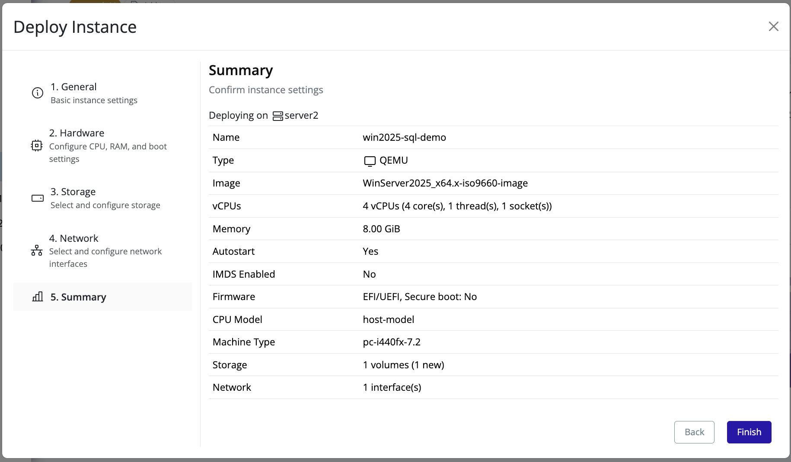

# Prepare Windows Server

## Download the Windows Server 2025 ISO
1. Open the [Microsoft Evaluation Center - Windows Server 2025](https://www.microsoft.com/en-us/evalcenter/evaluate-windows-server-2025) page in your browser, and follow the instructions to download the ISO.

   

4. Upload the ISO to Pextra CloudEnvironment®.

## Deploy the Windows Server 2025 ISO
>[!WARNING]
>The default CPU model (`qemu64`) is **not sufficient for Windows Server** and *will* result in a bootloop. If the instance fails to boot out of the installer and repeatedly restarts, first check that the CPU model is set to **`host-model`**.

> [!WARNING]
> Ensure that the disk bus type is set to **sata** or similar when attaching a disk. Windows Server will not recognize **virtio** disks.

1. Right-click the target node and select **Deploy**.
2. Fill in the instance name (for example, `win2025-sql-demo`), set the instance type to **QEMU**, and image to the Windows Server 2025 ISO you downloaded above. Click **Next**.
   
3. Set at least 4 vCPUs, and 8GiB of RAM (refer to the [Windows Server technical documentation](https://learn.microsoft.com/en-us/windows-server/get-started/specifications-and-limits) for resource requirements).
4. Expand **Advanced CPU Options** and set the **CPU model** to **`host-model`**. Click **Next**.
   
5. Attach a disk with at least 40 GiB of storage to a storage pool. Ensure the bus type is set to **sata**. Click **Next**.
   
6. Attach a network interface to a vSwitch that has access to the internet, with DHCP enabled. Click **Next**.
   
7. Confirm the configuration and click **Finish**. Wait for the instance to start.
   

## Next Steps
Proceed to [Install Windows Server 2025](./install-windows.md).
