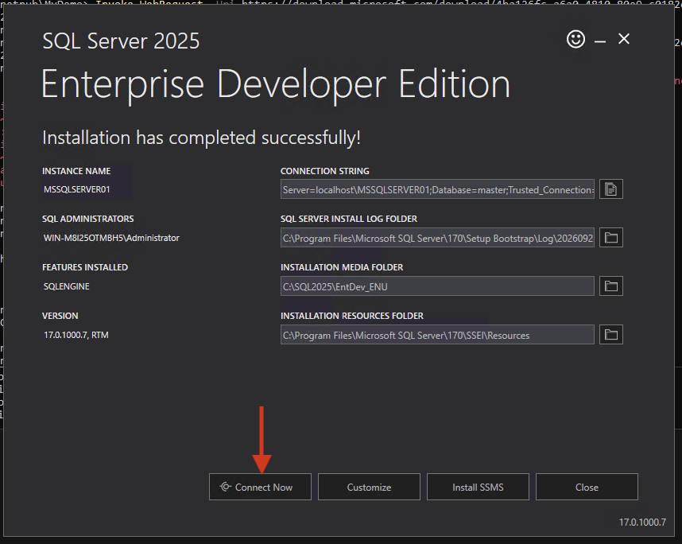
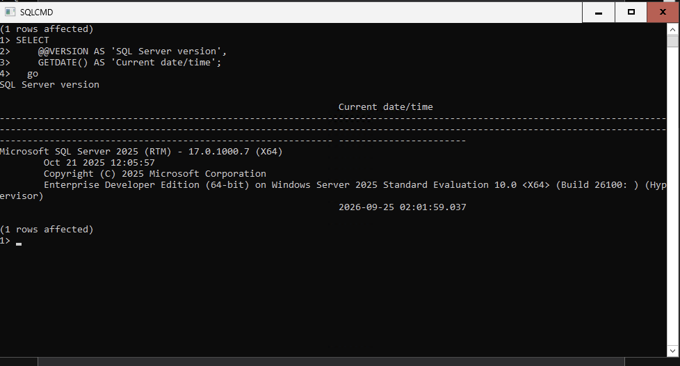

# Verify the SQL Server Installation
1. On the installer completion page, click **Connect now**. This opens a Command Prompt window with `sqlcmd` already connected to the new SQL Server instance.

  

2. Run the following query to retrieve the SQL Server version and the current date/time:
  ```sql
  SELECT
    @@VERSION AS 'SQL Server version',
    GETDATE() AS 'Current date/time';
  go
  ```

  Press Enter to submit the query. You should see the SQL Server version string and the current date/time returned.

  

Congratulations! You have a running Windows Server 2025 instance with SQL Server 2025 installed on Pextra CloudEnvironment®. You can now connect to the database engine from your workstation with any SQL client.