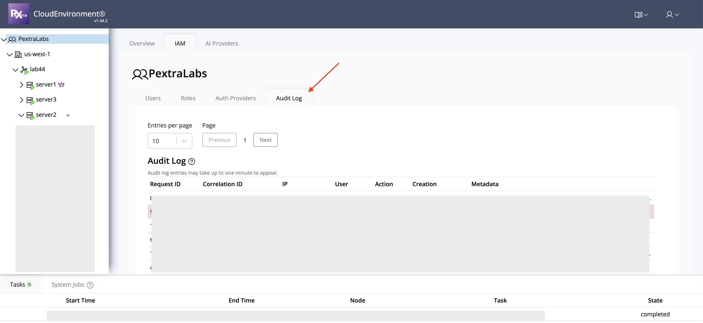

# Auditing and Compliance

The **Auditing and Compliance** module in Pextra Cloud Environment® enables administrators to **monitor user activity, track security events, and maintain compliance** with organizational policies. This functionality provides visibility into system operations and helps detect potential security issues or unauthorized access.

Key features include:

- **User Lockouts** – View and manage accounts that have been temporarily or permanently locked due to failed login attempts or policy violations.
- **Audit Logs** – Maintain a detailed history of user actions, administrative changes, and system events for auditing and compliance purposes.

> [!TIP]
> Regularly reviewing audit logs helps identify suspicious activity early and ensures adherence to security and compliance requirements.
