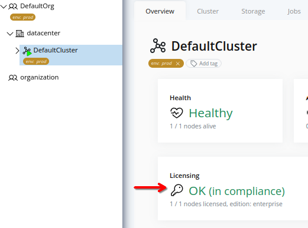
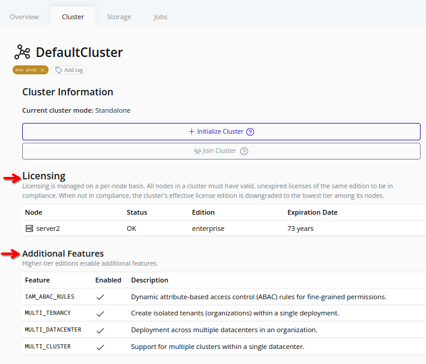

# Check Licensing Status
The licensing status of a cluster can be checked to ensure that the license keys for all nodes in the cluster are valid.

> [!TIP]
> License keys can be purchased from the [Pextra Customer Portal](https://portal.pextra.cloud). Support subscriptions are also available for purchase.

## Web Interface
1. Select the cluster in the resource tree and view the page on the right. A card with a quick overview of the licensing status will be displayed:
   
2. For a detailed view, click on the **Cluster** tab in the right pane. The licensing status of each node in the cluster will be displayed:
   