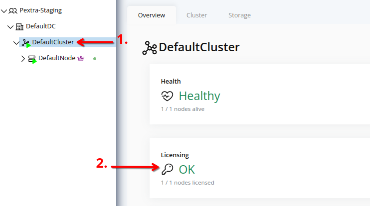
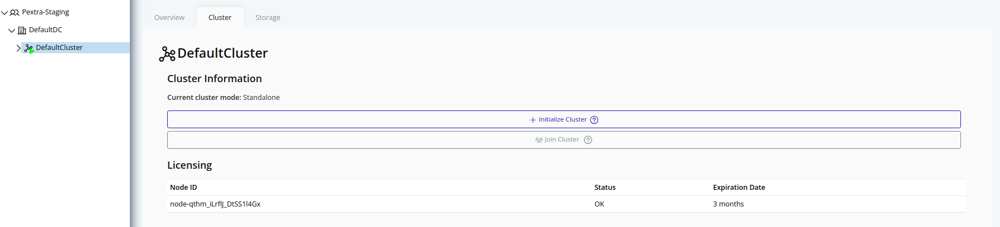

# Check Licensing Status
Use the cluster licensing view to make sure every node presents a valid, unexpired license key.

> [!TIP]
> License keys can be purchased from the [Pextra Customer Portal](https://portal.pextra.cloud). Support subscriptions are also available for purchase.

## Compliance Rules
Refer to the [Licensing Compliance Rules](../organizations/licensing/compliance-rules.md#cluster) section for details on cluster licensing compliance rules.

## Web Interface
1. Select the cluster in the resource tree and view the page on the right. A card with a quick overview of the licensing status will be displayed:
   
2. For a detailed view, click on the **Cluster** tab in the right pane. The licensing status of each node in the cluster will be displayed:
   

For more information on the **Additional Features** table, refer to the [Licensing](../organizations/licensing/feature-gating.md) section.