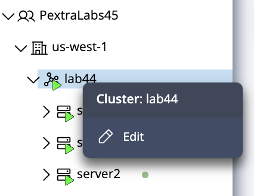
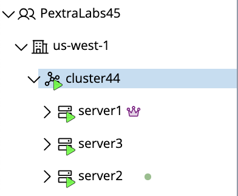

## Editing a Cluster

To update a cluster’s name or description:

1. In the **left navigation panel**, right-click on the **cluster** you want to modify.
   

2. Select **Edit** from the context menu.

3. Update the **Name** and/or **Description** fields as required.
4. Click **Confirm** to apply the changes.
 

