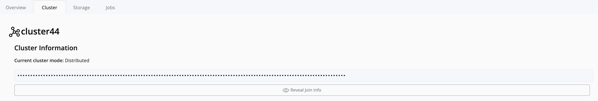

# Join Nodes to a Cluster

Clustering allows you to group multiple nodes into a single **cluster**, enabling resource sharing, redundancy, and centralized management within Pextra CloudEnvironment®.

> [!TIP]
> After installation, each node initially operates as a standalone cluster with one node. You can join additional nodes to an existing cluster using the join key.

## Creating and Joining a Cluster

Follow these steps to join nodes into an existing cluster:

1. **Log in** directly to the node’s management interface.
    - You should see one **cluster** and one **node** listed.
2. In the **left navigation panel**, click on **Cluster**.
3. On the right-hand panel, click on the **Cluster** you want to extend.
4. Obtain the **Join Key** for that cluster.  
   
5. **Copy** the join key.
6. Log in to each **new node** using its IP address and port `5007` (for example, `https://<node-ip>:5007`).
7. In the left navigation panel of each new node, click **Cluster**.
8. Click **Join Cluster**.
9. Paste the **join key** obtained earlier into the provided field and confirm the operation.
10. Return to the main cluster view.
11. You should now see the newly added node listed as a **member** of the cluster.

---

Once the process is complete, all joined nodes operate under a unified cluster, enabling centralized management of workloads, networking, and resources.
