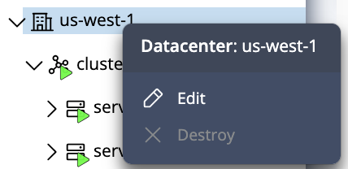
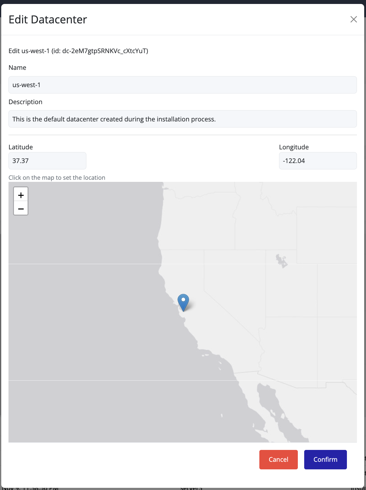

## Editing a Datacenter

You can update a datacenter’s **name**, **description**, or **location** directly from the UI:

1. In the **left navigation panel**, right-click on the **datacenter** you want to edit.
2. Select **Edit** from the context menu.

3. Update the **Name**, **Description**, or **Location** fields as needed.

4. Click **Confirm** to save the changes.

> [!TIP]
> To change the **geographical location**, click directly on the desired point on the map.  
> The **latitude** and **longitude** values are computed automatically.  
> Avoid manually entering coordinates—simply select the location on the map and then click **Confirm**.
