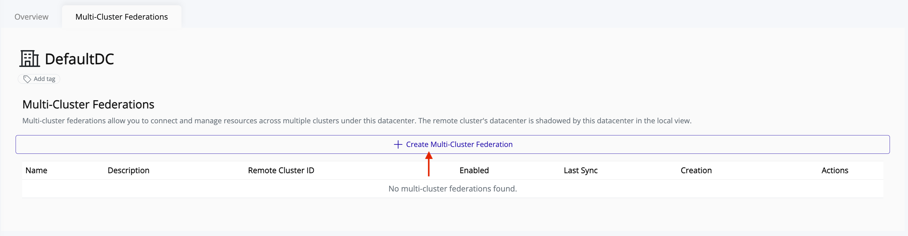
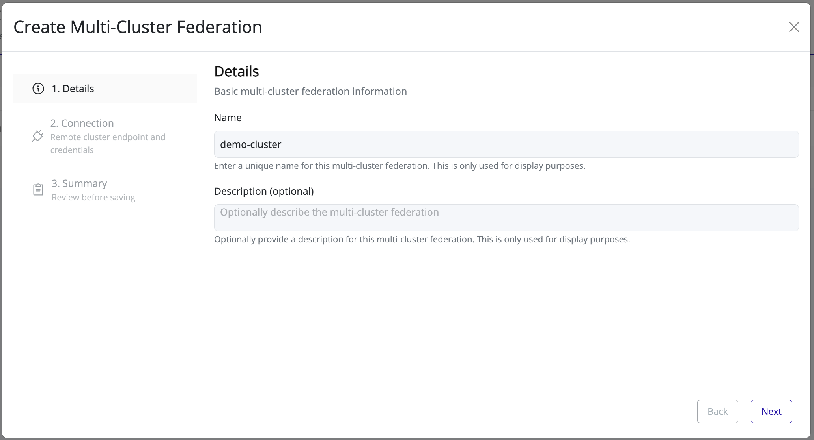
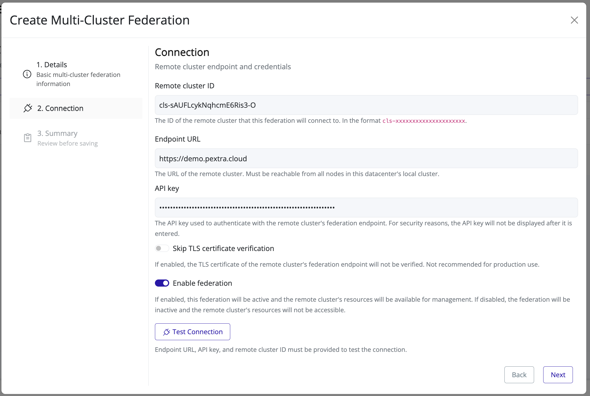
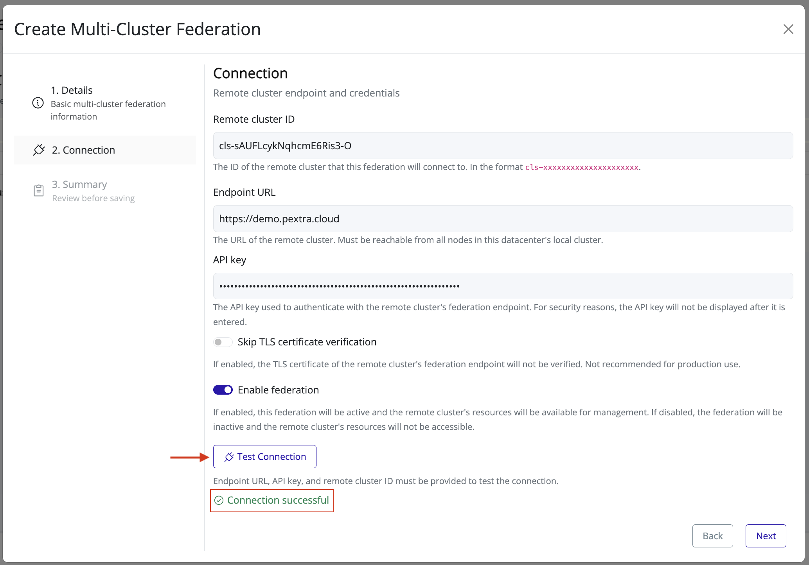
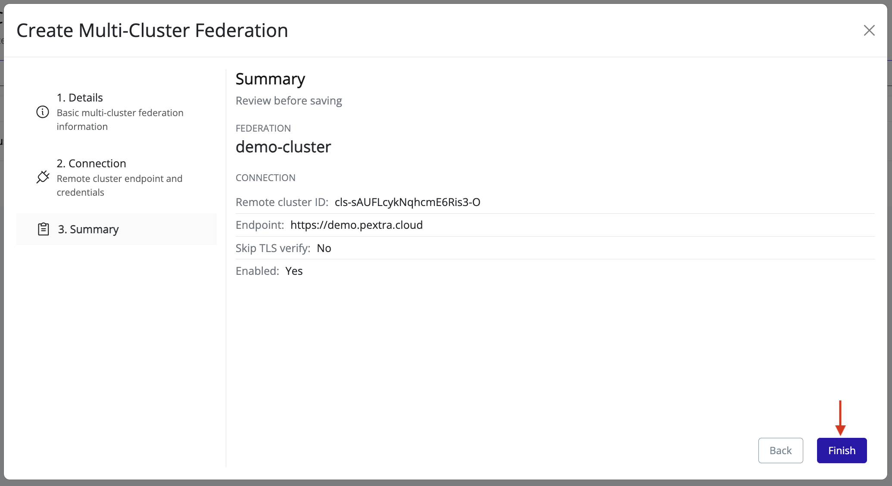

# Create Multi-Cluster Federation
> [!TIP]
> Prepare the following information from the remote deployment before you start:
> 1. The **remote cluster ID** (in the format `cls-xxxxxxxxxxxxxxxxxxxxx`): this can be copied from your browser's address bar when viewing the remote cluster's page.
> 2. The **endpoint URL** of the remote deployment (in the format `https://federation.example.com:5007`): must be reachable from **all nodes** in your local cluster.
> 3. An **API key** on the remote deployment that grants access to the federation endpoint.

> [!NOTE]
> Any actions performed through the federation will use this API key, so ensure it has the necessary permissions. Refer to the [Connectivity](./connectivity.md) section for more details.

1. Select the datacenter in the resource tree and view the page on the right. Click on the **Multi-Cluster Federations** tab in the right pane:

   
2. Click the **Create Multi-Cluster Federation** button:

   
3. In the **Details** step, provide basic information:

   
4. In the **Connection** step, provide the remote cluster's connection details (remote cluster ID, endpoint URL, and API key):

   
5. Click **Test Connection** to verify the remote cluster's connection details. Proceed to the **Summary** step if the connection is successful:

   
6. Review the summary and click **Finish** to finalize:

   

The multi-cluster federation will immediately become active, allowing the local datacenter to communicate and with the remote cluster.

To update the federation settings, refer to the [Edit Federation](./edit-federation.md) section.