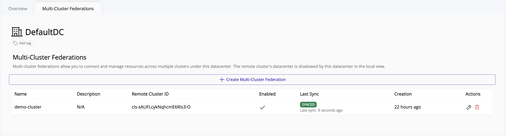
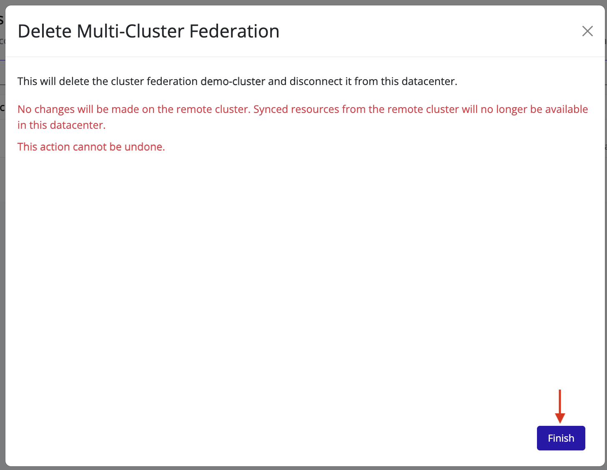

# Delete a Multi-Cluster Federation
> [!WARNING]
> Deleting a multi-cluster federation is irreversible and will immediately disconnect the remote cluster from the datacenter. All federated resources from the remote cluster will become inaccessible from the local cluster.

> [!TIP]
> When testing changes or onboarding a new multi-cluster federation, consider disabling the multi-cluster federation first instead of deleting it. This allows you to re-enable it without reconfiguration if needed.

To remove a multi-cluster federation from the datacenter:
1. Select the datacenter in the resource tree that owns the multi-cluster federation. Click the **Multi-Cluster Federations** tab.

   

2. Click the **trash icon** on the federation's row.

   

3. A confirmation dialog will appear. Click **Confirm** to permanently remove the multi-cluster federation.

   

