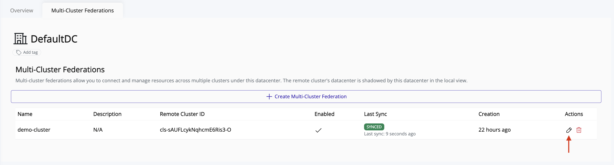
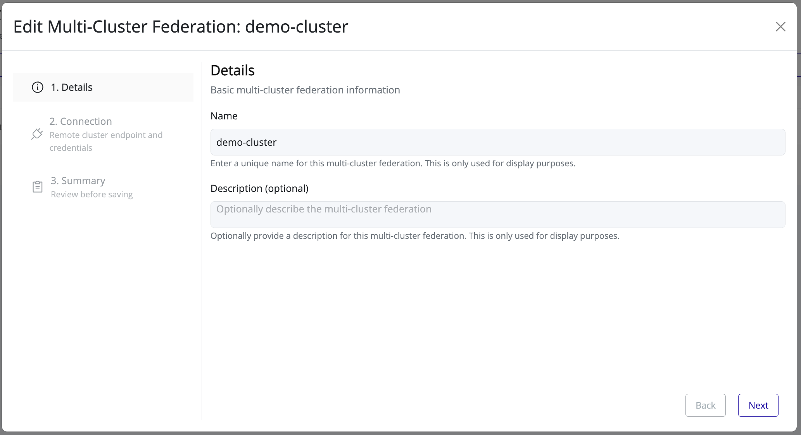
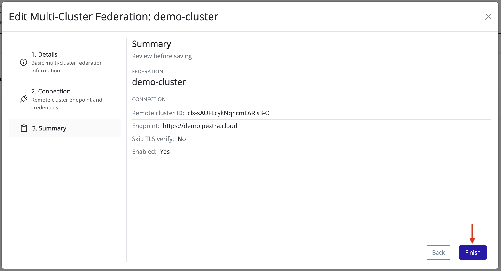

# Edit Multi-Cluster Federation
> [!NOTE]
> For security reasons, the federation's **API key** is never displayed. If you need to test the connection while editing, you must re-enter the API key. Leave the **API key** field blank to keep the existing key.

1. Select the datacenter in the resource tree and view the page on the right. Click on the **Multi-Cluster Federations** tab in the right pane:

   
2. Click the **pencil** icon in the **Actions** column of the federation you want to change. 

   
3. The wizard opens pre-filled with the federation's current values. Modify the fields as described in the [Create Federation](./create-federation.md) section:

   
4. Review the summary and click **Finish** to save changes:

   

The new multi-cluster federation settings will apply immediately.
