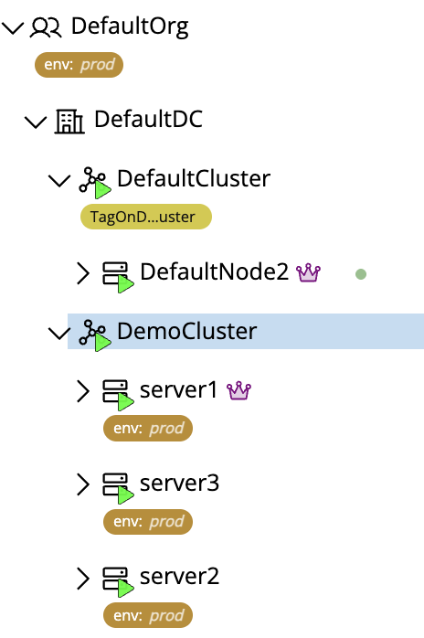

# Multi-Cluster Federations

> [!NOTE]
> Multi-cluster federations require the `MULTI_CLUSTER` feature flag, which is available in the **Enterprise** edition. See [Feature Gating](../../organizations/licensing/feature-gating.md) for details.

A multi-cluster federation connects a remote cluster to a local datacenter, allowing resources from the remote cluster to be seamlessly managed alongside local resources. Once connected, the remote cluster's nodes, instances, and other relevant resources appear under the in the local datacenter in the resource tree:

Operations on federated resources are transparently forwarded over a secure, authenticated connection to the remote cluster. Refer to the [Connectivity](./connectivity.md) section for details on how federated clusters are connected and synchronized.

The ID prefix for multi-cluster federations is `clsfed-`[^1].

## Notes

[^1]: Resources in Pextra CloudEnvironment® are identified by unique IDs. Multi-cluster federation IDs have the prefix `clsfed-`, followed by a unique identifier (e.g., `clsfed-VrP6KxEw19aQb2hTnY4Ld`).
