# VM Management

This guide outlines the steps to create a virtual machine (VM) using **Pextra CloudEnvironment®**. It assumes that **Pextra CloudEnvironment®** is properly installed and managed.

### 1. **Access the Dashboard**

- Open your browser and navigate to the **Pextra CloudEnvironment®** dashboard.
- Log in using your administrator credentials.

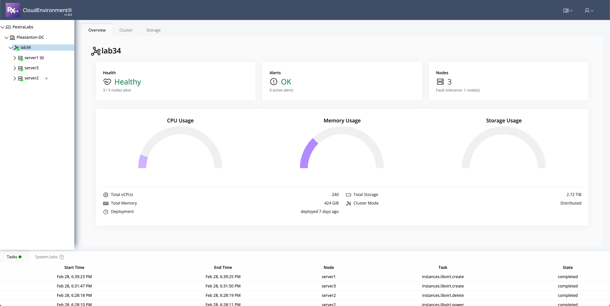

### 2. **Deploy an instance**

- From the left panel, click on the desired server.
- Right-click on the server icon and select **Deploy**.

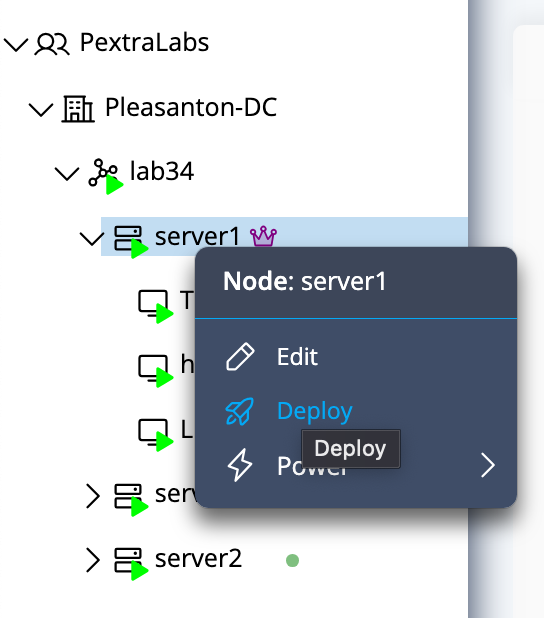

### 3. **Configure Virtual Machine Settings**

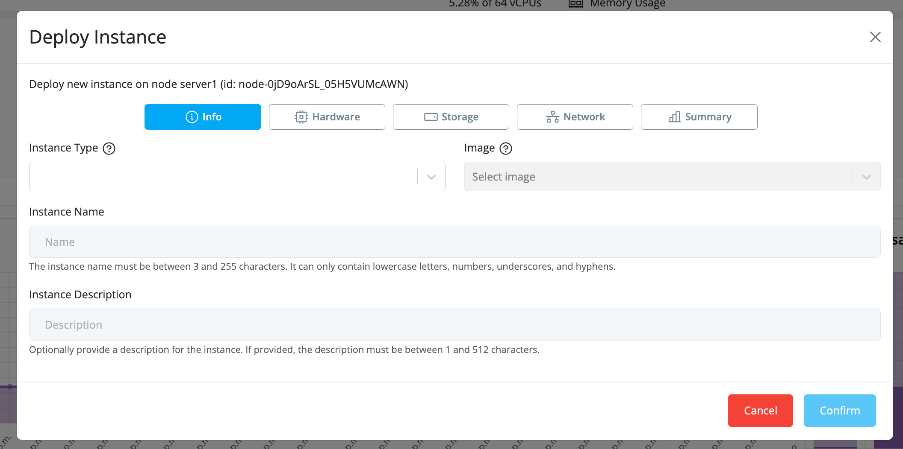

- **Instance Type**: Select the desired instance type (VM or container).

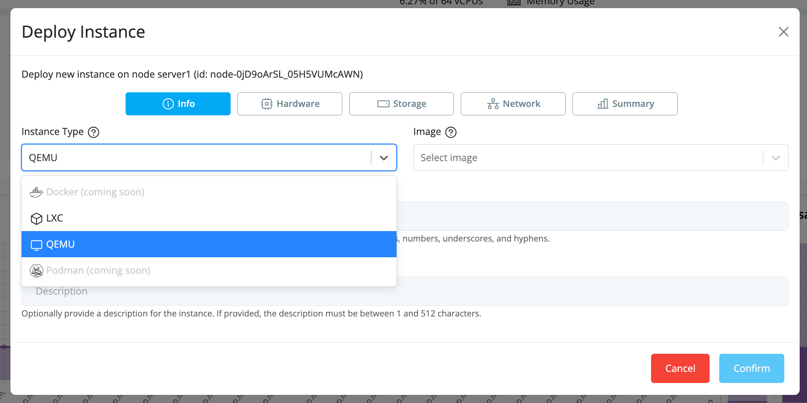

- **VM Name**: Provide a unique and meaningful name for your virtual machine (note that name uniqueness is not enforced).

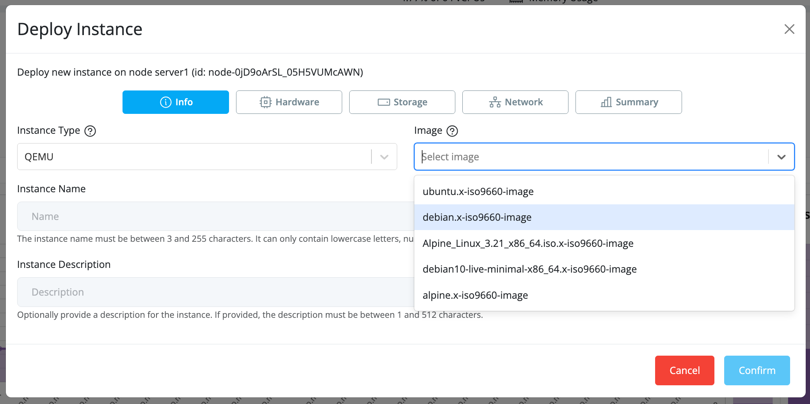

- **Image**: Select the desired image (ISO) from the available images on the selected server. If a new image is required, you can download it from **ImageHub™** (At server level).
- **Description**: Add a description for the instance.

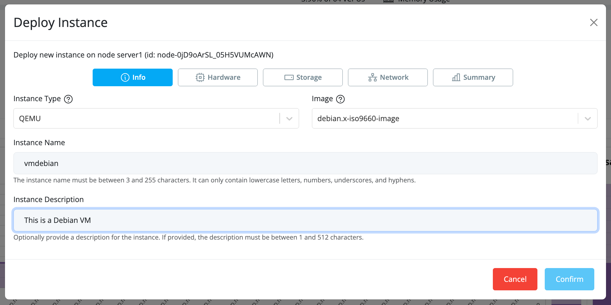

- **Hardware**: Select the number of desired CPUs and the size of RAM. You can also click on **Advanced** for further customization of cores. Ensure that **Autostart** is enabled to allow the VM to start automatically after creation.

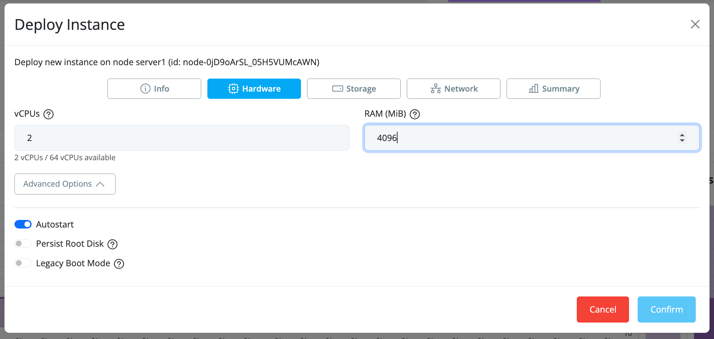

- **Storage**: Attach a storage disk by selecting a pool (created at the cluster level) and specifying the desired disk size.

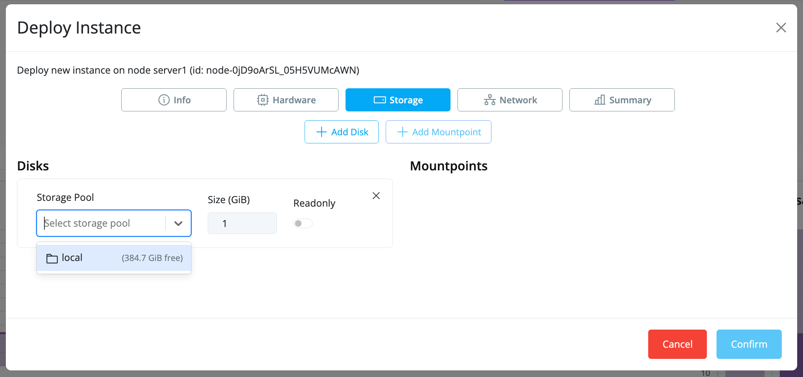  
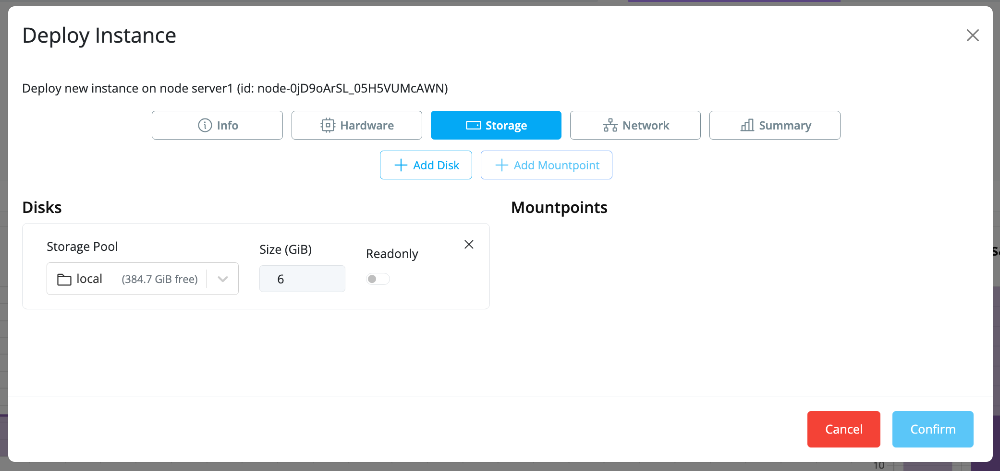

- **Networking**: Attach a **vSwitch** to enable networking. Creation and management of the vSwitch are done at the node (server) level.

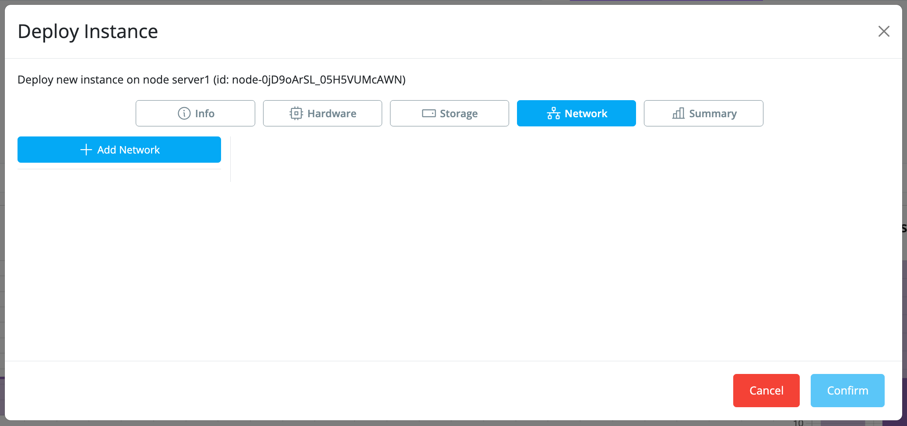  
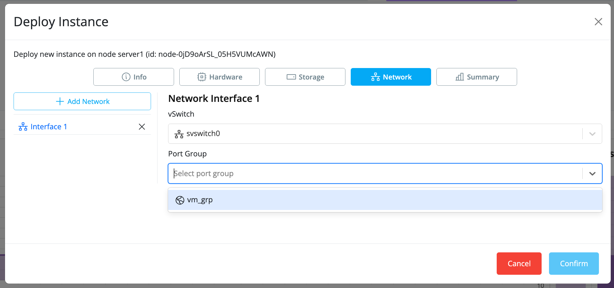

- **Summary and Review**: Review the instance details and click **Confirm** to proceed.

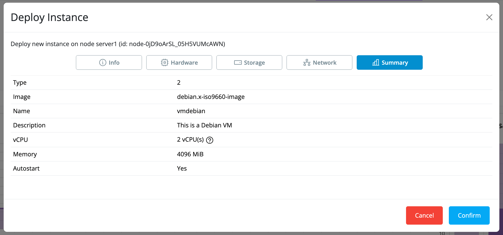

### 4. **Manage the Virtual Machine**

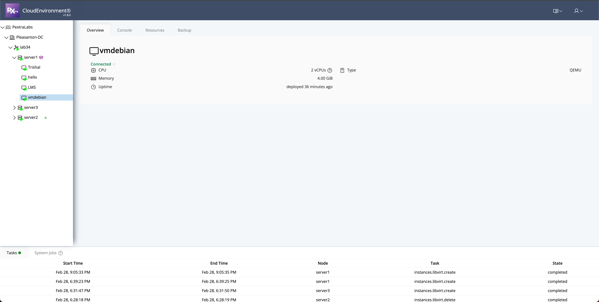

- **Console Access**: Click on the **Console** tab to access the VM directly via the prompt. You can test connectivity, such as by running a **ping** command.

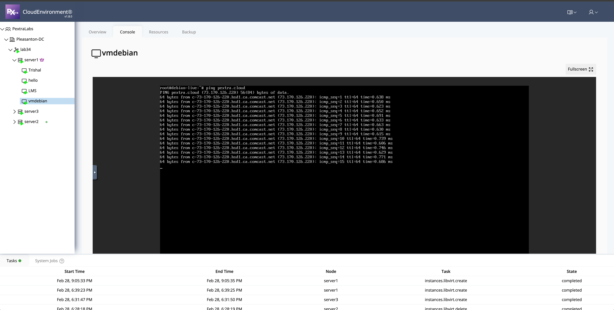

- **PCI Passthrough**: Click on the **Resources** tab to attach devices (e.g., GPUs, USB drives, PCI devices) for passthrough to the VM.

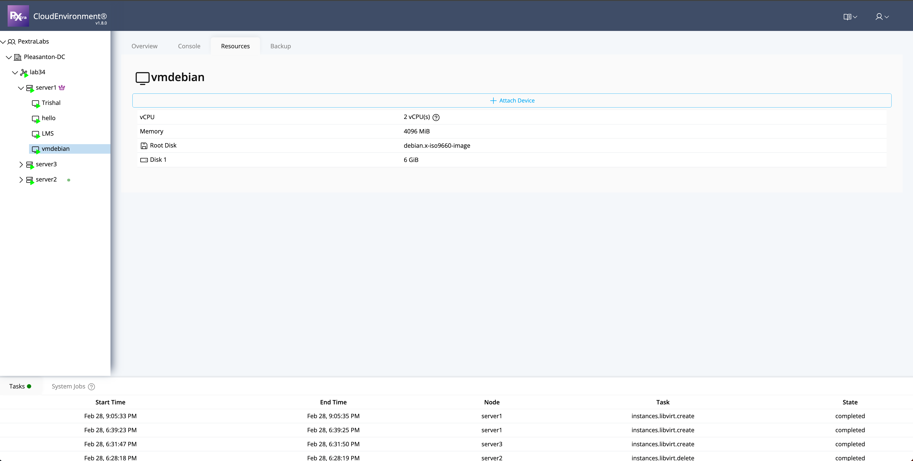
