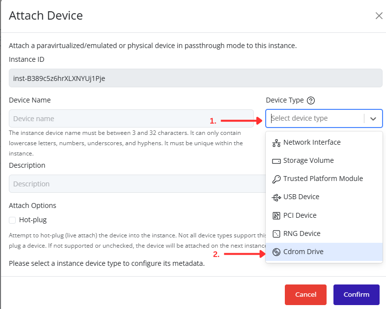
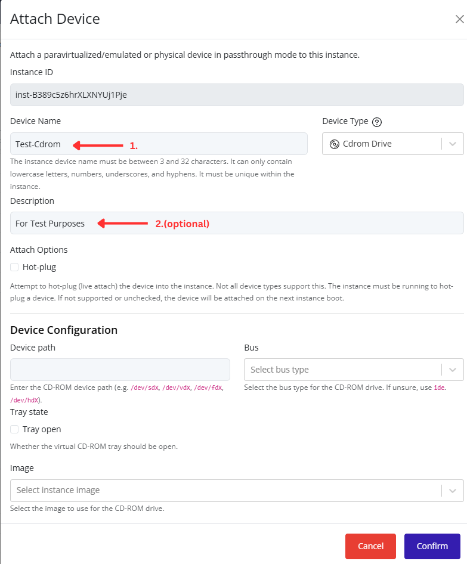
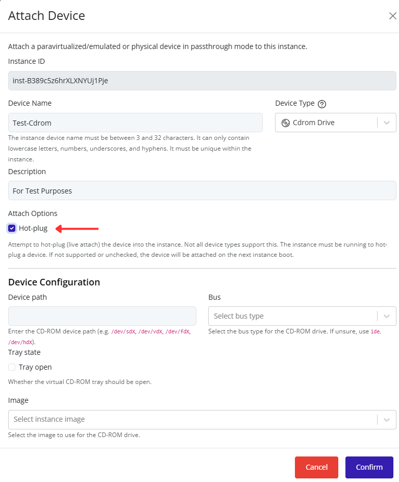
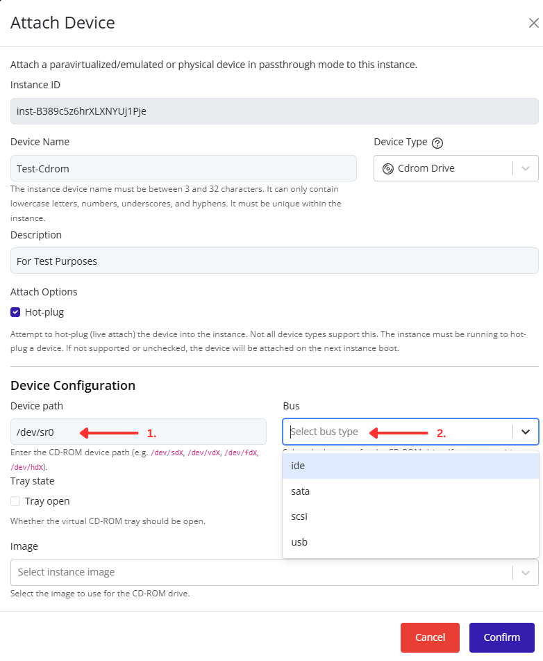
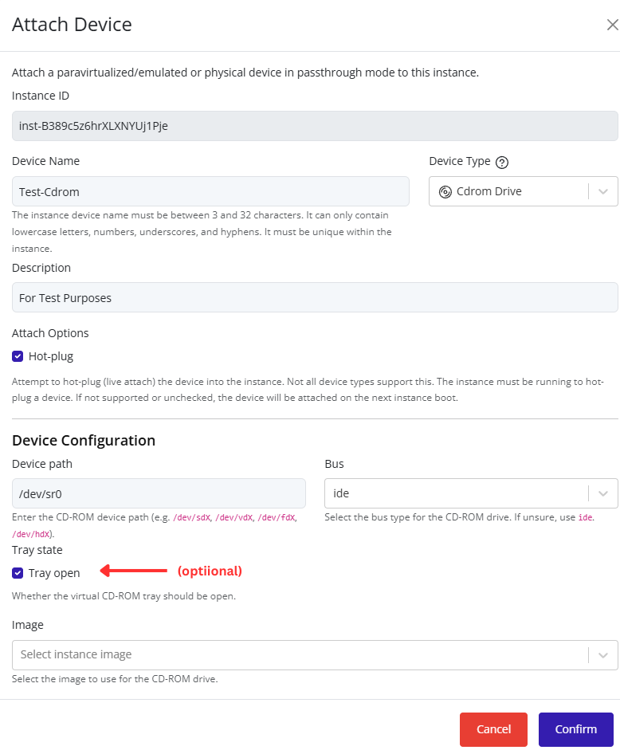
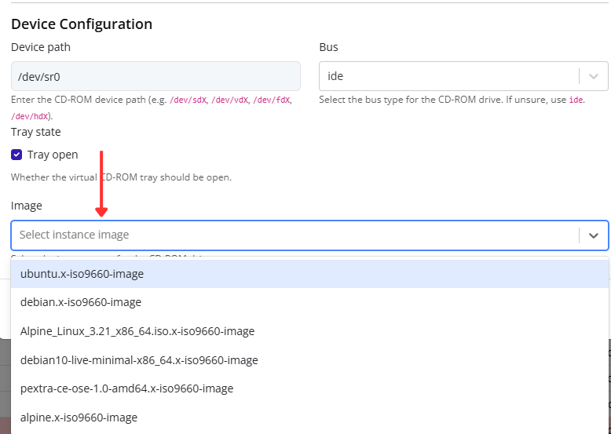
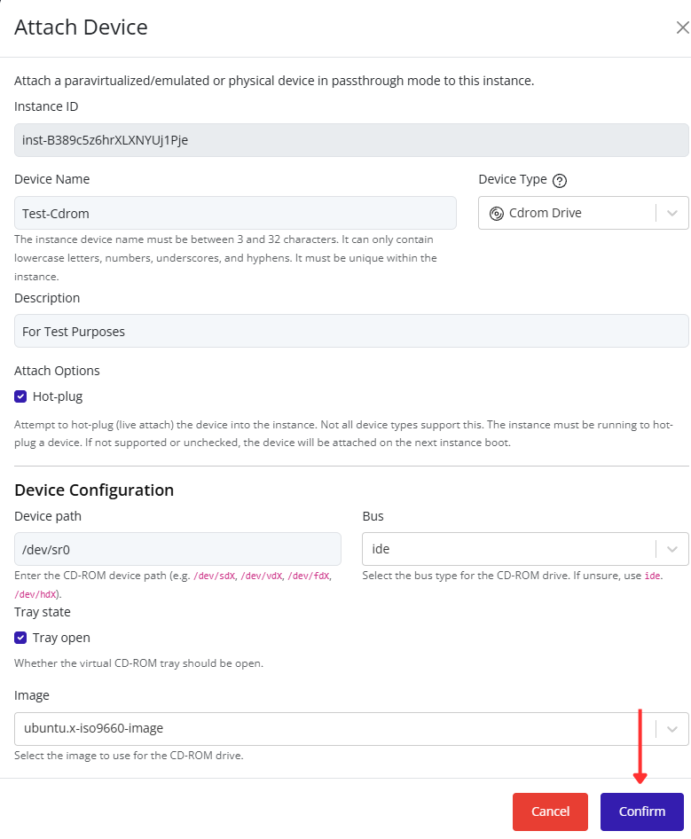

# Attaching a CDROM Drive

Attach a CDROM drive to an instance through the Pextra CloudEnvironment® web interface.

1. Select the virtual machine in the resource tree and view the page on the right. Click on the **Resources** tab in the right pane. The configuration and attached devices will be listed.

   

2. Click the **Attach Device** button.

   

3. Select **CDROM Drive** from the **Device Type** dropdown list. Additional CDROM drive configuration options will appear at the bottom of the dialog.

   

4. Enter a device name and optional description.

   

5. Optionally enable **Hot-plug** to attach the CDROM drive to a running instance. If Hot-plug is not enabled, the instance must be stopped before attaching the device.

   

6. Enter a **Device path** for the CDROM drive and select a **Bus** type.

   

> [!NOTE]
> The device path must be unique within the instance and must not conflict with any existing attached devices.
>
> Common bus types include:
>
> | Bus Type | Description |
> |-----------|-----------|
> | **ide** | Recommended default for most CDROM devices and provides broad guest operating system compatibility. |
> | **sata** | Commonly used for modern storage and optical devices with wide operating system support. |
> | **scsi** | Often used in enterprise environments and advanced storage configurations. |
> | **usb** | Presents the device through a virtual USB controller, which may be useful for guest operating systems that expect removable media over USB. |

7. Optionally enable **Tray open** if the virtual CDROM tray should be open when the device is attached.

   

8. Select an image from the **Image** dropdown list. This image will be mounted in the CDROM drive and made available to the guest operating system.

   

9. Click **Confirm** to attach the CDROM drive to the instance.

   