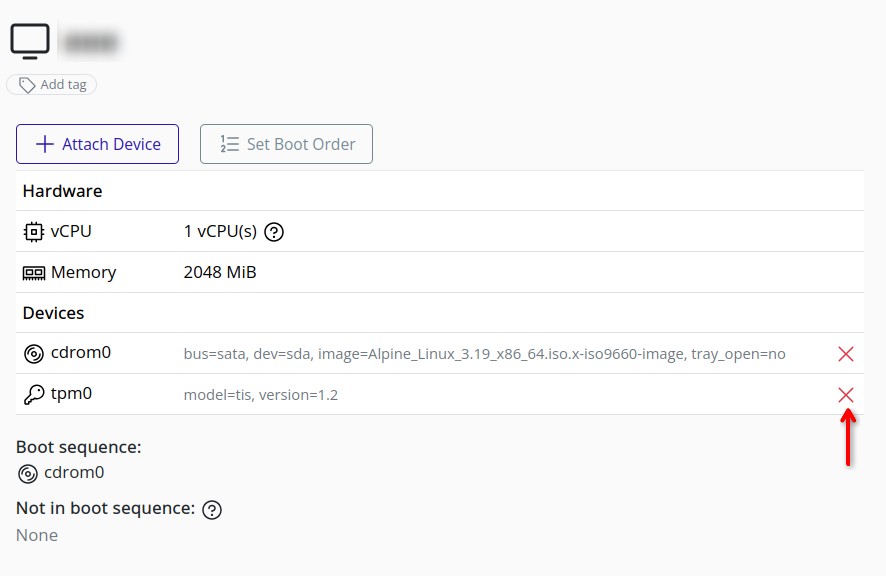
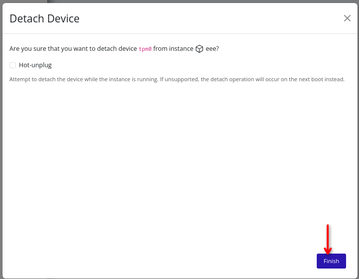

# Detach Device

>[!NOTE]
>Some device types may require the instance to be stopped before detaching. To attempt a live detachment, check the "Hot-unplug" checkbox. If the device is in use, you may need to stop the instance before detaching the device. 

1. Select the virtual machine in the resource tree and view the page on the right. Click on the Resources tab in the right pane. The configuration and attached devices will be listed.

   

2. To detach a device, click the **X** icon in the row of the desired device.

   

3. A confirmation popup will appear. Click **Finish** to confirm the detachment of the device from the instance.

   