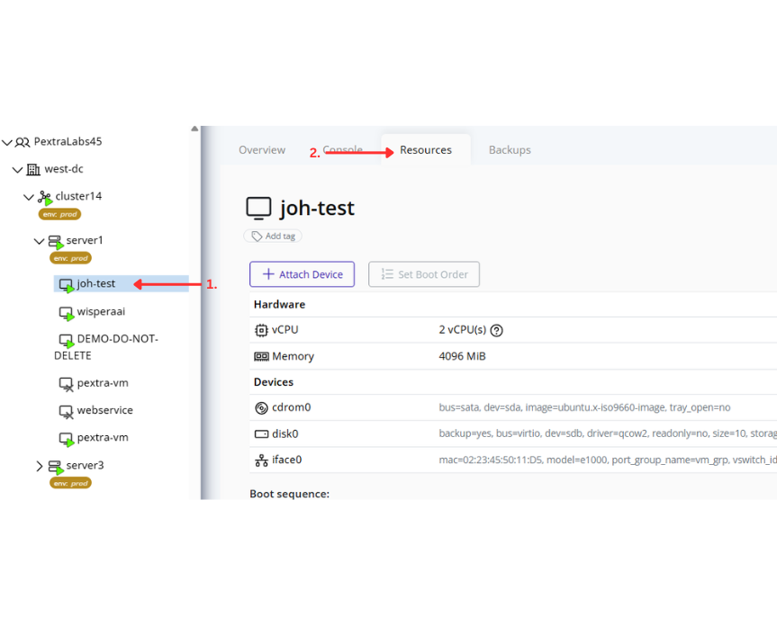
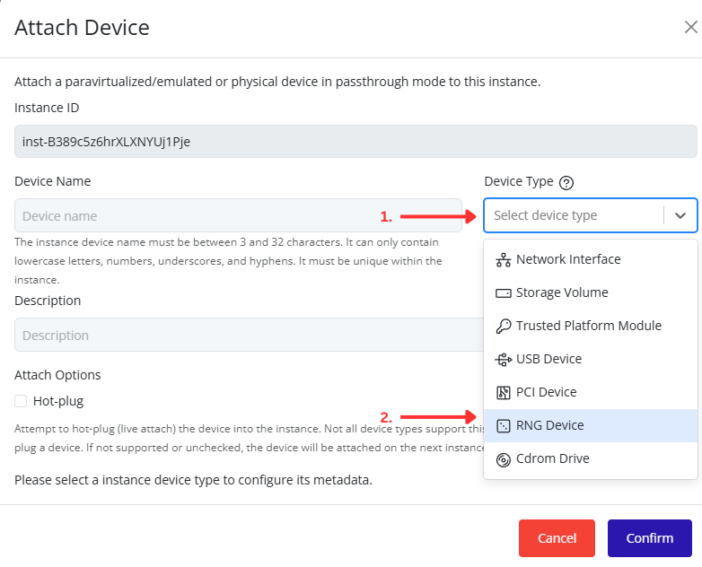
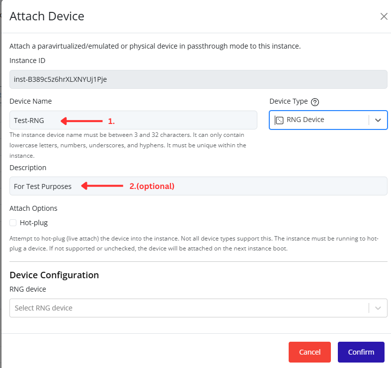
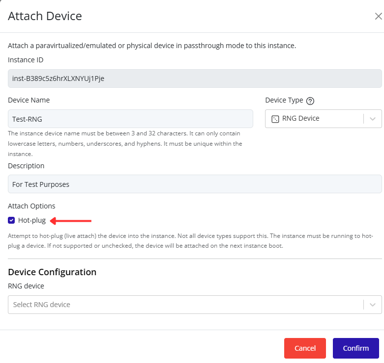
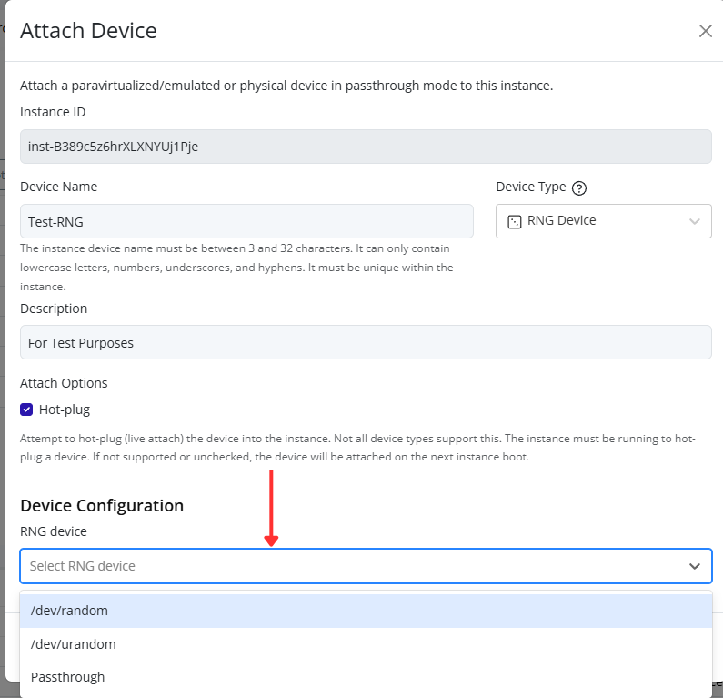
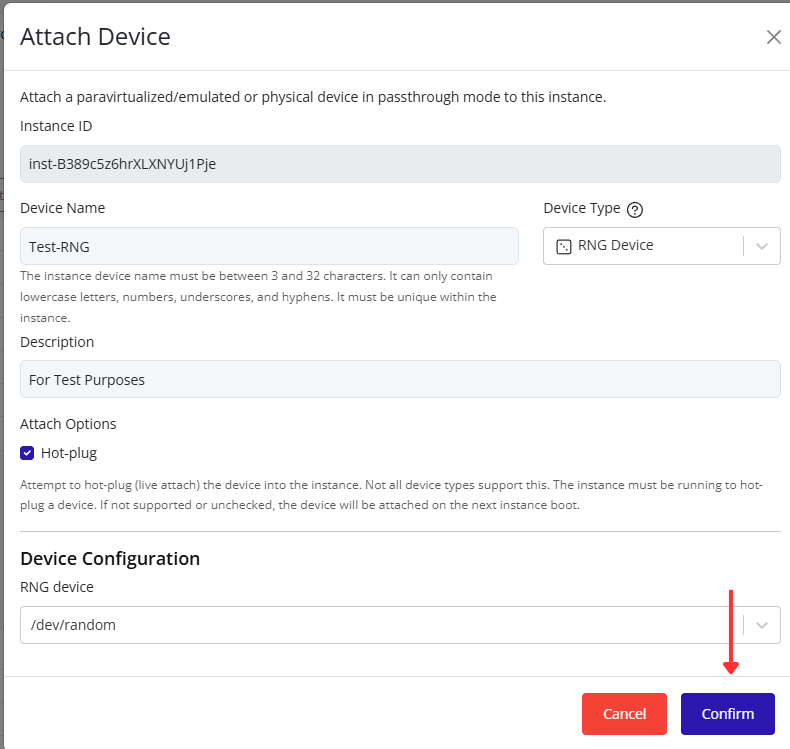

# Attaching an RNG Device

Attach an RNG device to an instance through the Pextra CloudEnvironment® web interface.

1. Select the virtual machine in the resource tree and view the page on the right. Click on the **Resources** tab in the right pane. The configuration and attached devices will be listed.

   

2. Click the **Attach Device** button.

   

3. Select **RNG Device** from the **Device Type** dropdown list. Additional RNG device configuration options will appear at the bottom of the dialog.

   

4. Enter a device name and optional description.

   

5. Optionally enable **Hot-plug** to attach the RNG device to a running instance. If Hot-plug is not enabled, the instance must be stopped before attaching the device.

   

6. Select an RNG device from the **RNG device** dropdown list.

   

> [!NOTE]
> RNG devices provide a source of randomness to the guest operating system and are commonly used for cryptographic operations, key generation, and other security-related functions.
>
> Available RNG device options include:
>
> | RNG Device | Description |
> |-----------|-----------|
> | **/dev/random** | Provides high-quality random data and may block when insufficient entropy is available. |
> | **/dev/urandom** | Provides random data without blocking and is recommended for most workloads. |
> | **Passthrough** | Passes the host system's RNG device directly to the instance, allowing the guest to use the host's entropy source. |

7. Click **Confirm** to attach the RNG device to the instance.

   