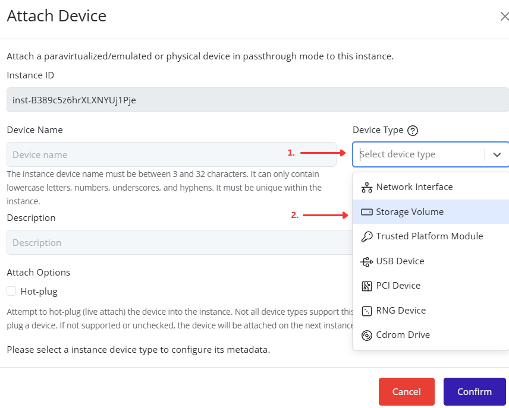
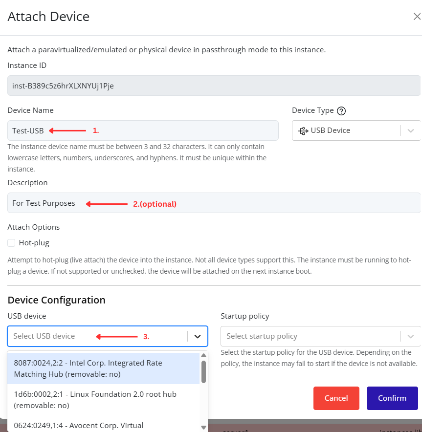
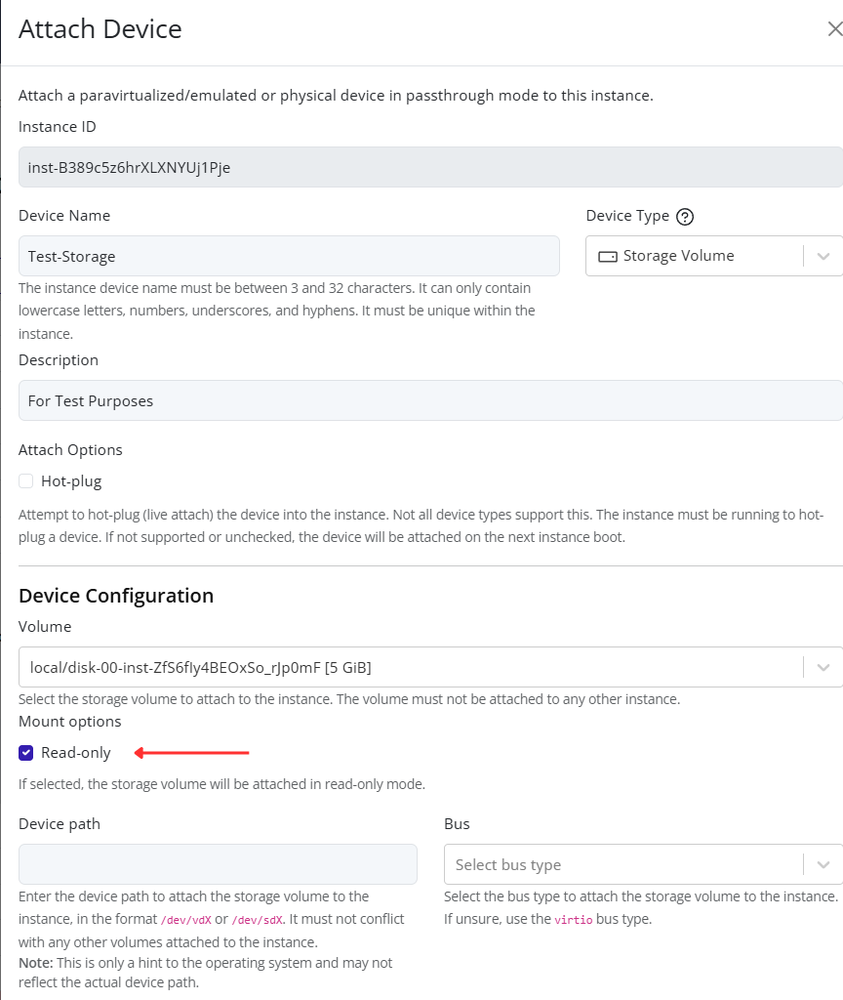
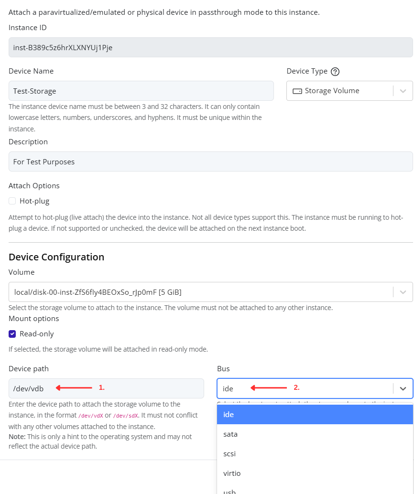
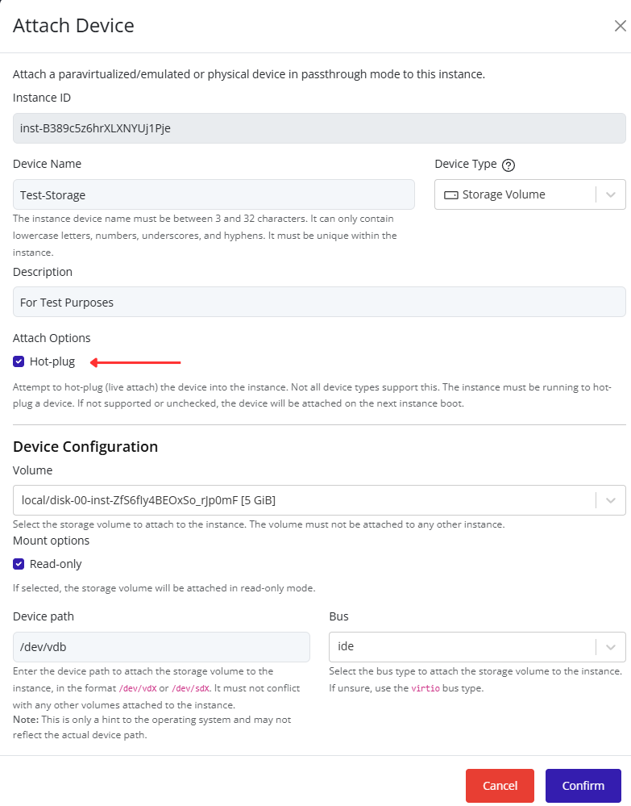
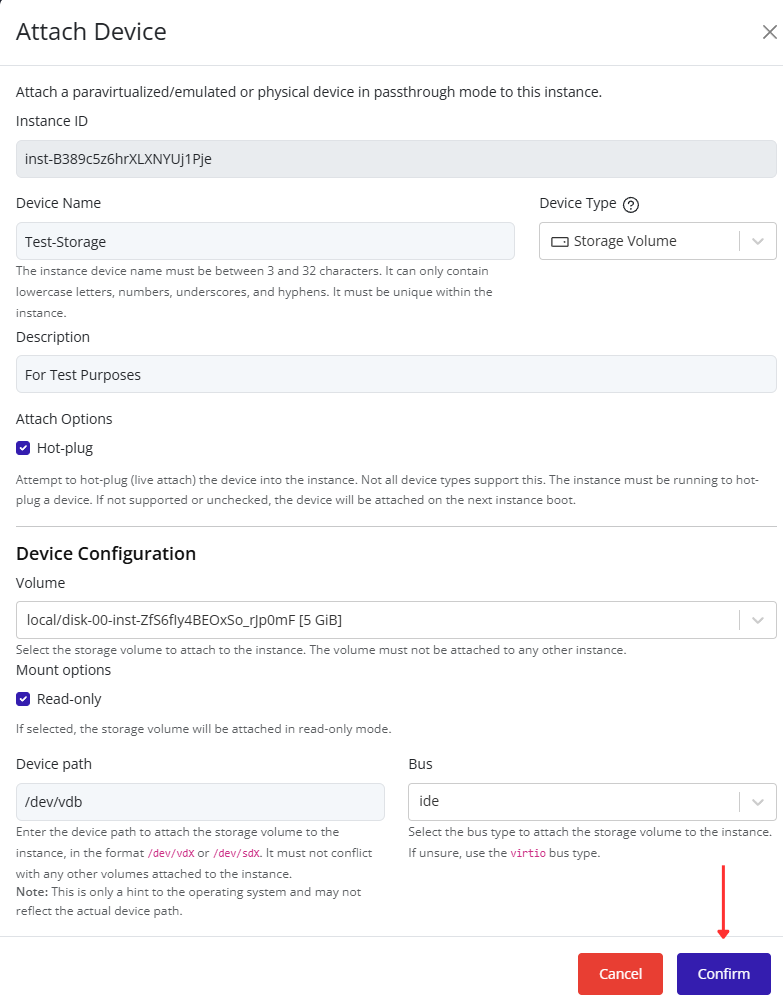

# Attaching a Storage Volume

Attach a storage volume to an instance through the Pextra CloudEnvironment® web interface.

1. Select the virtual machine in the resource tree and view the page on the right. Click on the **Resources** tab in the right pane. The configuration and attached devices will be listed.

   

2. Click the **Attach Device** button.

   

3. Select **Storage Volume** from the **Device Type** dropdown list. Additional storage volume configuration options will appear at the bottom of the dialog.

   

4. Enter a device name and optional description. Select the storage volume from the **Volume** dropdown list.

   

5. Optionally enable **Read-only** mode to attach the storage volume without allowing write operations from the instance.

   

6. Enter a **Device path** for the volume and select a **Bus** type. Go to [!NOTE] for more infomation on the different **Bus** types.

   

7. Optionally enable **Hot-plug** to attach the storage volume to a running instance. If Hot-plug is not enabled, the instance must be stopped before attaching the volume.

   

8. Click **Confirm** to attach the storage volume to the instance.

   

[!NOTE]
The device path must be unique within the instance and must not conflict with any existing attached storage devices.

Common bus types include:

| Bus Type | Description |
|-----------|-----------|
| **virtio** | Recommended for most Linux guests and provides the best performance. |
| **sata** | Provides broad compatibility with guest operating systems. |
| **scsi** | Commonly used for advanced storage configurations and enterprise workloads. |