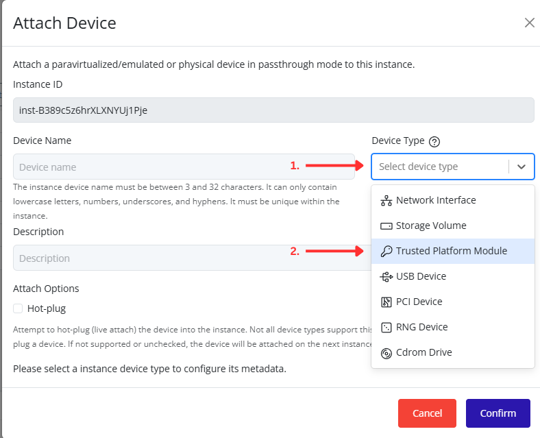
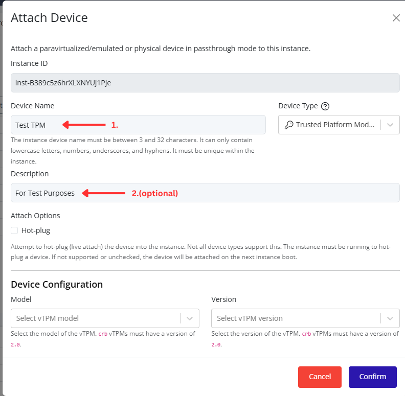
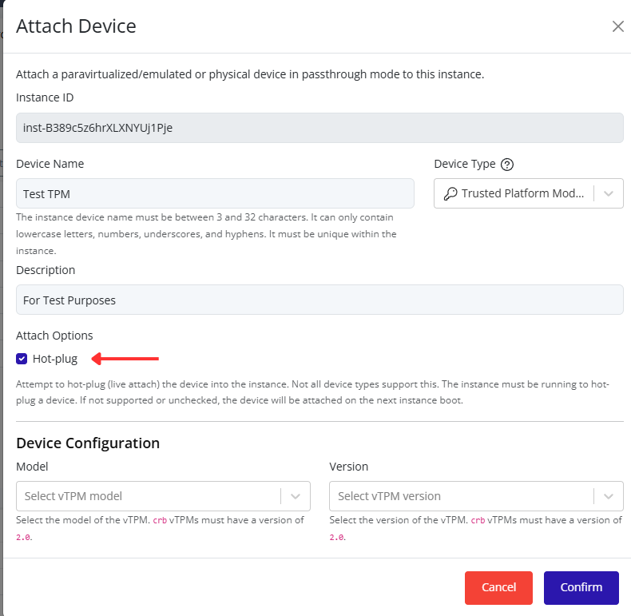
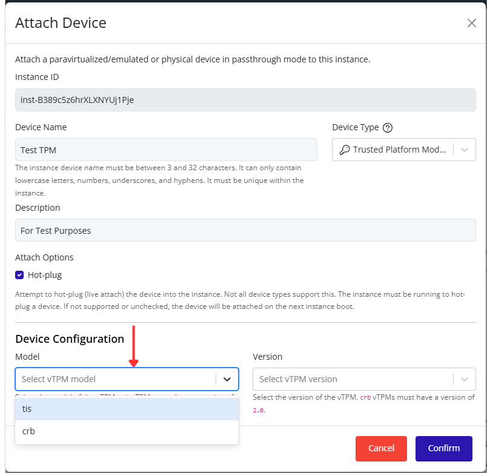
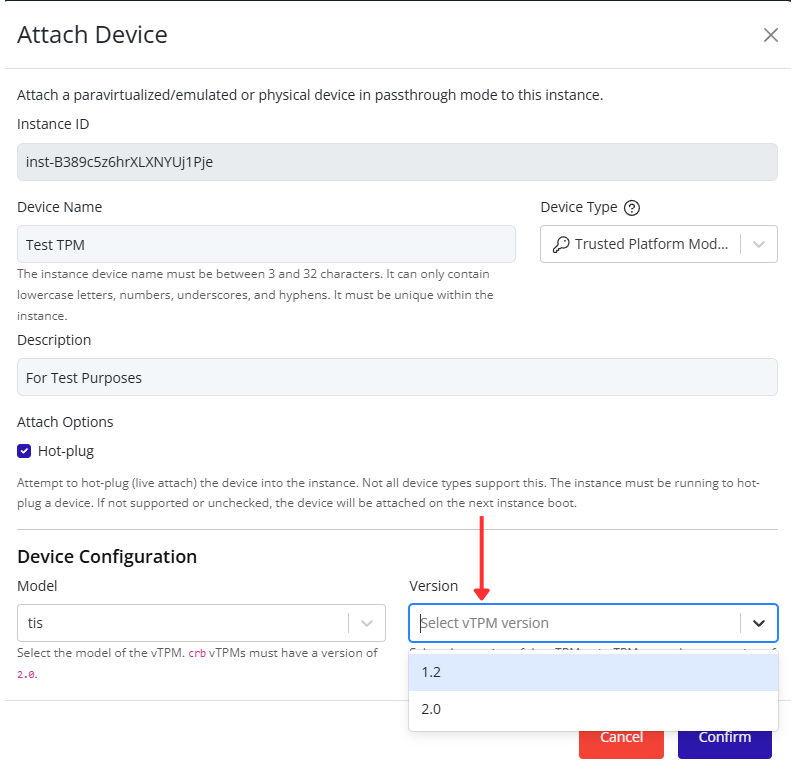
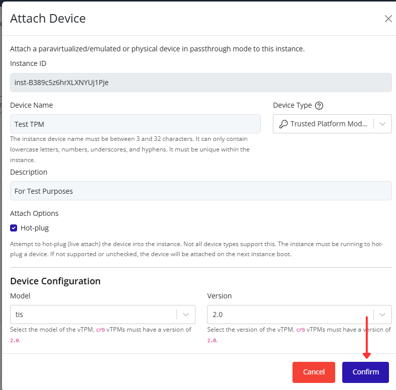

# Attaching a Trusted Platform Module (TPM)

Attach a Trusted Platform Module (TPM) to an instance through the Pextra CloudEnvironment® web interface.

1. Select the virtual machine in the resource tree and view the page on the right. Click on the **Resources** tab in the right pane. The configuration and attached devices will be listed.

   

2. Click the **Attach Device** button.

   

3. Select **Trusted Platform Module (TPM)** from the **Device Type** dropdown list. Additional TPM configuration options will appear at the bottom of the dialog.

   

4. Enter a device name and optional description.

   

5. Optionally enable **Hot-plug** to attach the TPM device to a running instance. If Hot-plug is not enabled, the instance must be stopped before attaching the device.

   

6. Select a TPM **Model**.

   

> [!NOTE]
> Available TPM models include:
>
> | Model | Description |
> |---------|-------------|
> | **crb** | Modern TPM interface recommended for TPM 2.0 deployments. |
> | **tis** | Legacy TPM interface provided for compatibility with older operating systems. |

7. Select a TPM **Version**.

   
   
> [!NOTE]
> Available TPM versions include:
>
> | Version | Description |
> |---------|-------------|
> | **1.2** | Legacy TPM specification. |
> | **2.0** | Current TPM specification recommended for modern operating systems. |
>
> The **crb** model requires TPM version **2.0**.

8. Click **Confirm** to attach the TPM device to the instance.

   