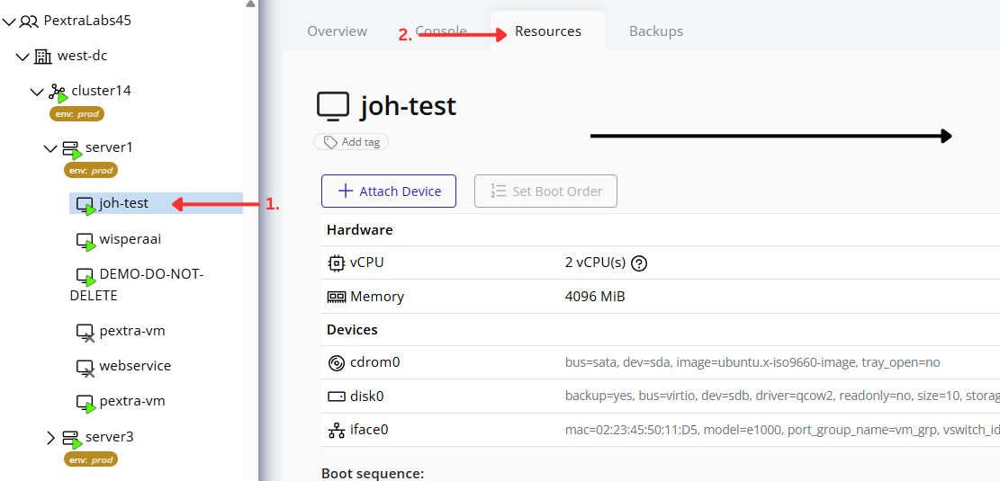
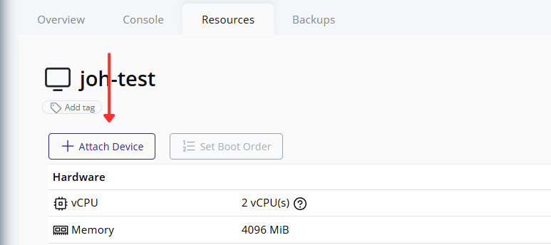
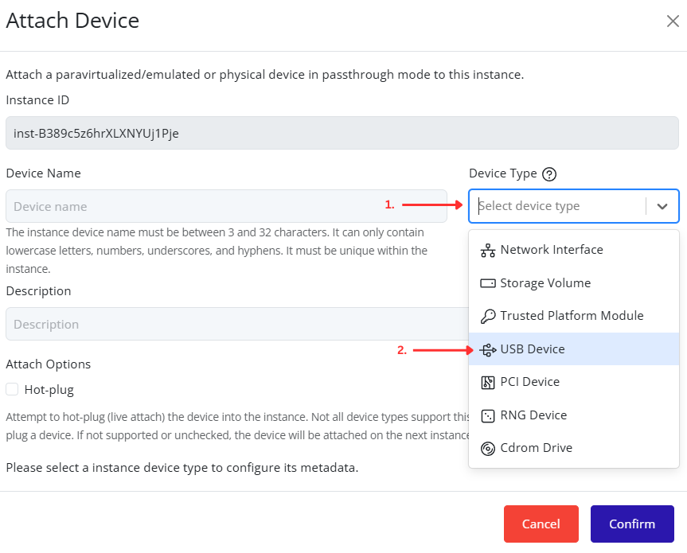
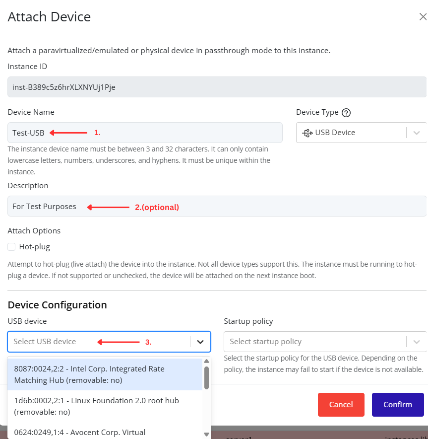
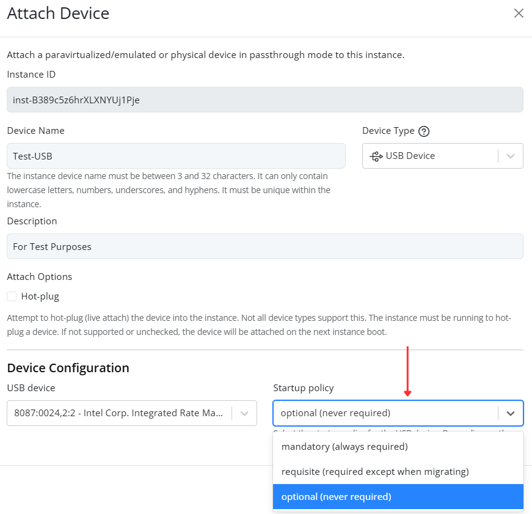
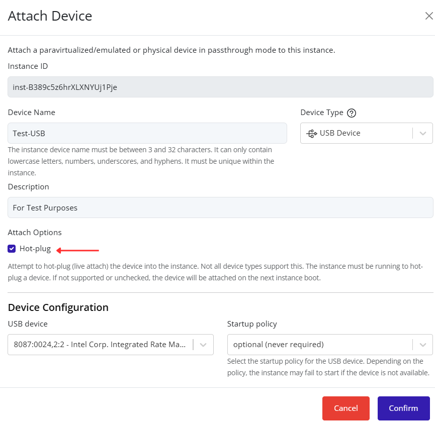
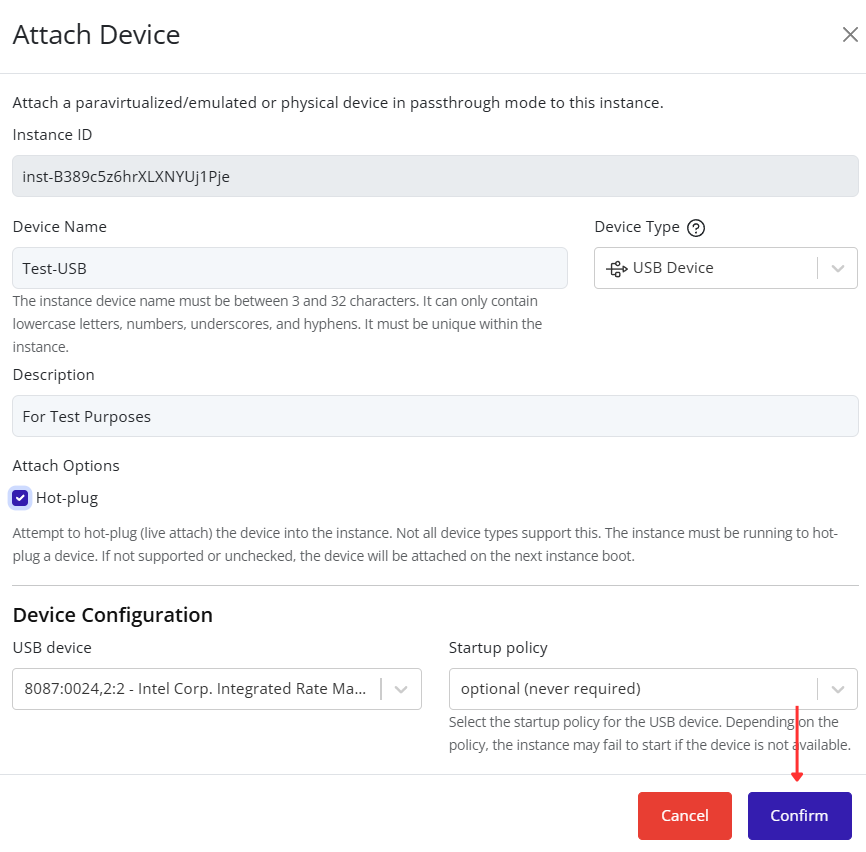

# Attaching a USB Device

Attach a USB device to an instance through the Pextra CloudEnvironment® web interface.

1. Select the virtual machine in the resource tree and view the page on the right. Click on the **Resources** tab in the right pane. The configuration and attached devices will be listed.

   

2. Click the **Attach Device** button.

   

3. Select **USB Device** from the **Device Type** dropdown list. Additional USB device configuration options will appear at the bottom of the dialog.

   

4. Enter a device name and optional description. Select the USB device from the **USB device** dropdown list.

   

5. Choose a **Startup policy** for the USB device. Depending on the selected policy, the instance may fail to start if the USB device is unavailable. 
   | Policy | Description |
   |----------|----------|
   | **mandatory** | The USB device must be available for the instance to start. If the device is unavailable, startup will fail. |
   | **requisite** | Same as `mandatory`, but not required when migrating the instance to another node. |
   | **optional** | The USB device is not required for the instance to start. If the device is unavailable, startup will succeed, but the device will not be available to the instance. |

   

6. Optionally enable **Hot-plug** to attach the USB device to a running instance. If Hot-plug is not enabled, the instance must be stopped before attaching the device. Attempting to attach the device while the instance is running will fail.

   

7. Click **Confirm** to attach the USB device to the instance.

   

