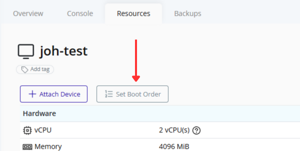
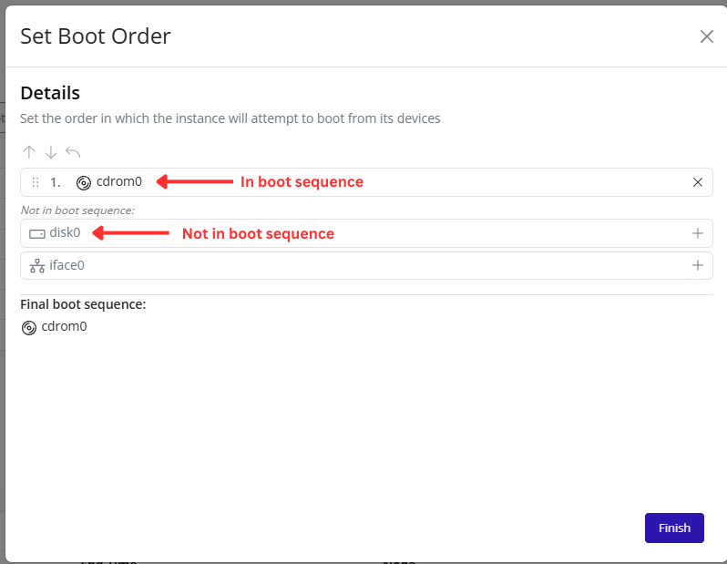
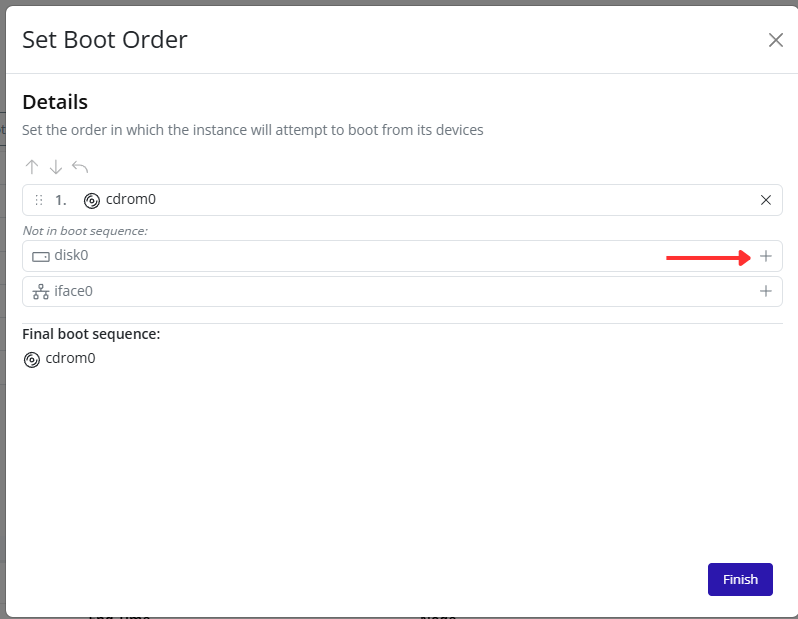
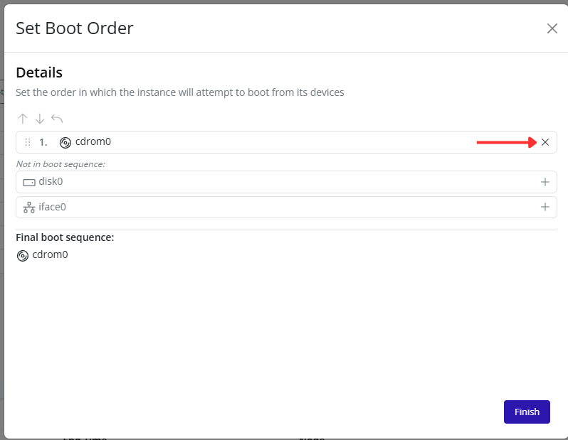
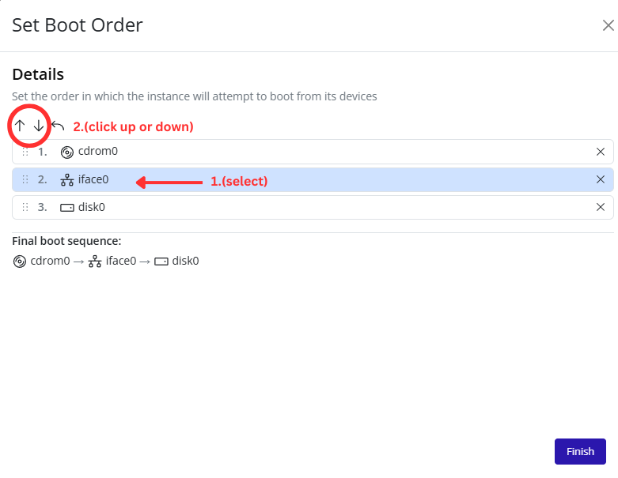
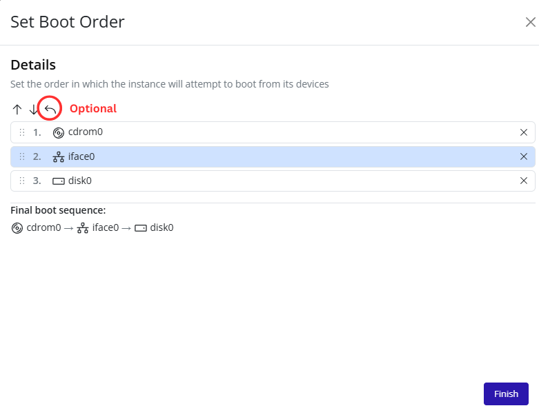
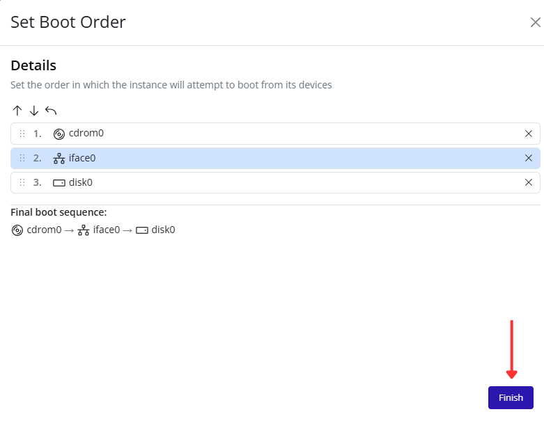

# Setting Boot Order

Configure the order in which an instance attempts to boot from its attached devices through the Pextra CloudEnvironment® web interface.

1. Select the virtual machine in the resource tree and view the page on the right. Click on the **Resources** tab in the right pane. The configuration and attached devices will be listed.

   

2. Click the **Set Boot Order** button.

   

3. The **Set Boot Order** dialog will appear. Devices currently included in the boot sequence are displayed at the top of the dialog. Devices that are not currently included in the boot sequence are displayed below.

   

4. To add a device to the boot sequence, click the **+** button next to the device under **Not in boot sequence**.

   

5. To remove a device from the boot sequence, click the **X** button next to the device in the current boot sequence.

   

6. First **Select** a device then use the **Up** and **Down** arrow buttons to change the order of devices in the boot sequence. Devices higher in the list will be attempted before devices lower in the list.

   

7. Optionally click the **Reset** button to restore the default boot sequence.

   

8. Review the **Final boot sequence** section to verify and click **Finish** to save the boot order configuration.

   

> [!NOTE]
> The instance will attempt to boot from devices in the order shown in the **Final boot sequence** section.
>
> For example, if a CDROM device is listed before a disk device, the instance will attempt to boot from the CDROM first.
>
> If the first device is unavailable or not bootable, the instance will continue to the next device in the sequence.

