# Instance Deploy

To deploy a new instance (VM or container):

1. **Right-click** on the target node and select **Deploy**.

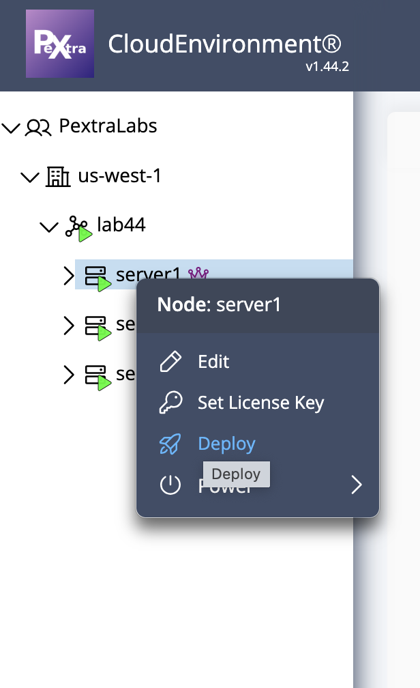

2. The **Deploy Instance** overlay will appear for configuration.

   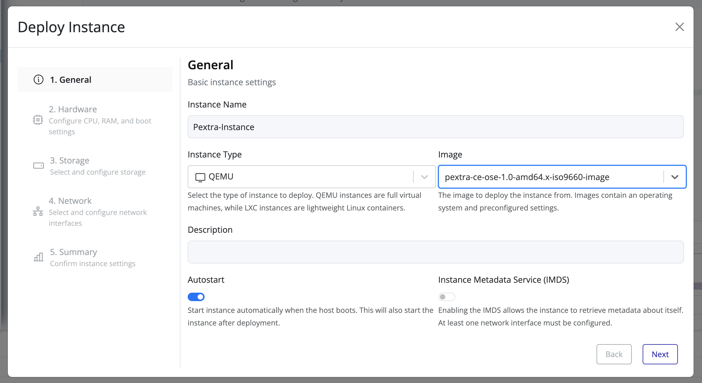

3. Fill in the required general instance information and click **Next** for customizations.

   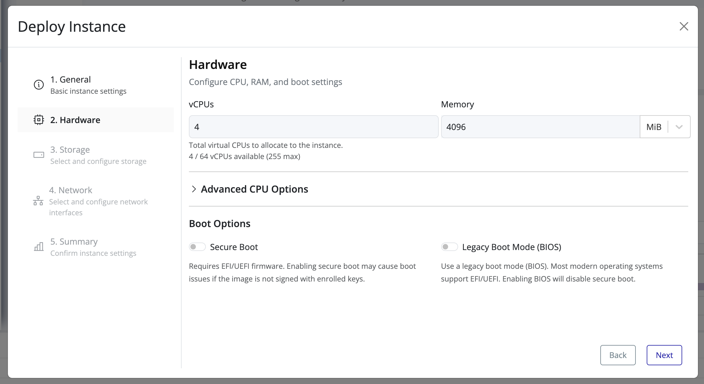

4. Add a volume (disk space) as needed and click **Next**.

   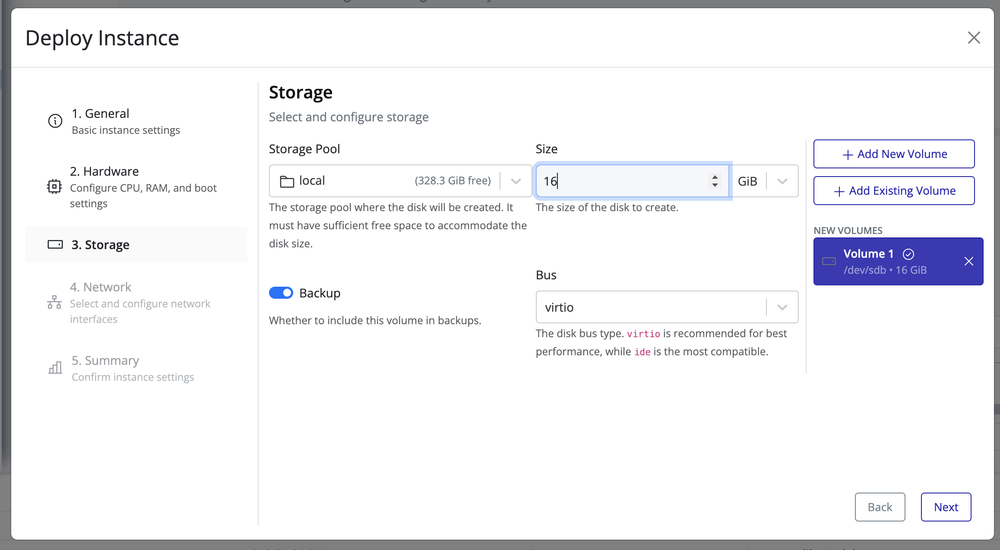

5. Configure networking for connectivity if required and click **Next**.

   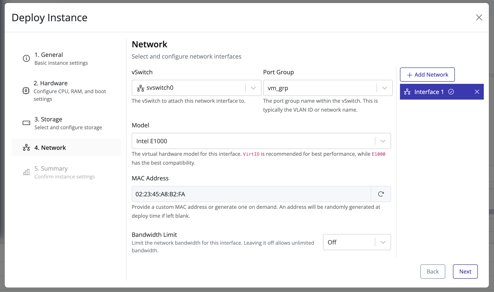

6. Review the configuration and click **Finish**.

   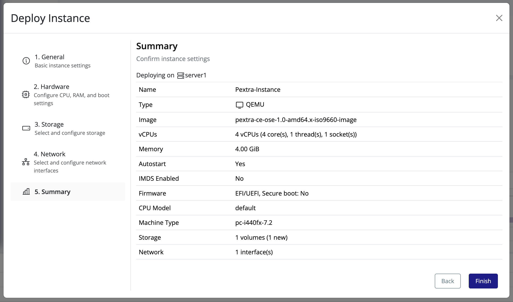

7. The new instance will appear under the selected node.

   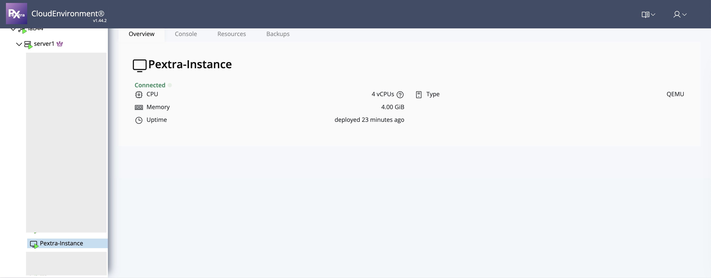

8. Click on the instance to view its **properties** and access the **console**.

   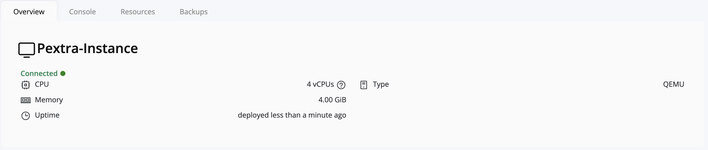

9. Click on the instance to view its details:
    - To access the **console**, select the **Console tab**.
   
      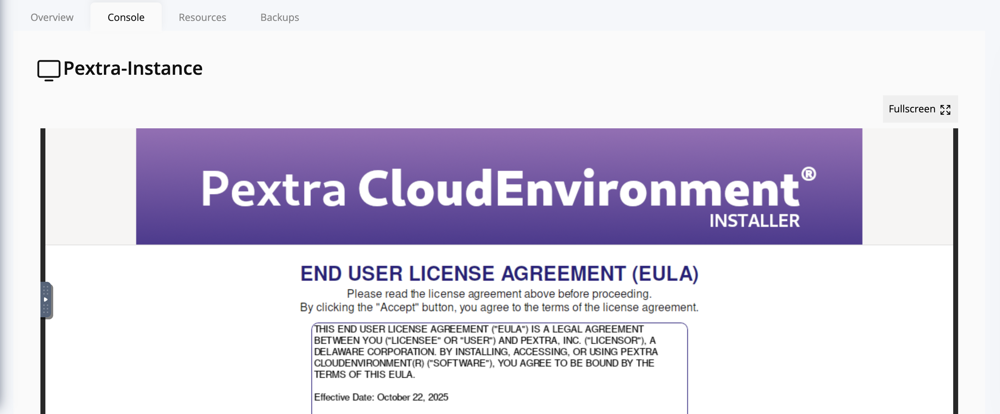

  - To view and adjust **instance resources**, click on the **Resources tab**.
    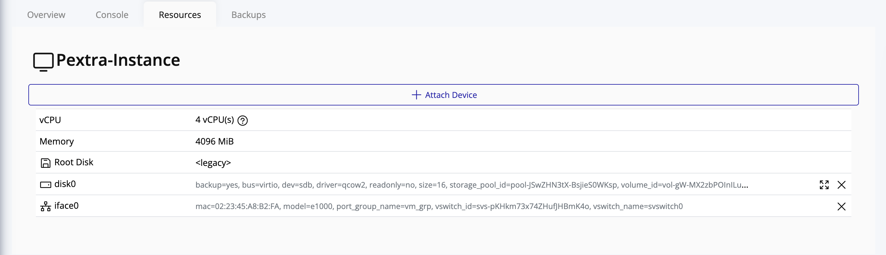

  - To view instance snapshots and create backups, click on the **Backups tab**.

   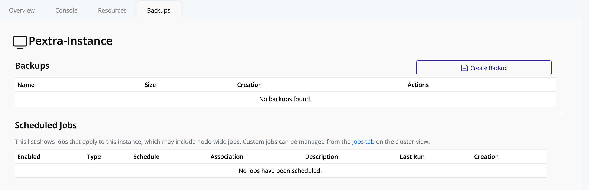
