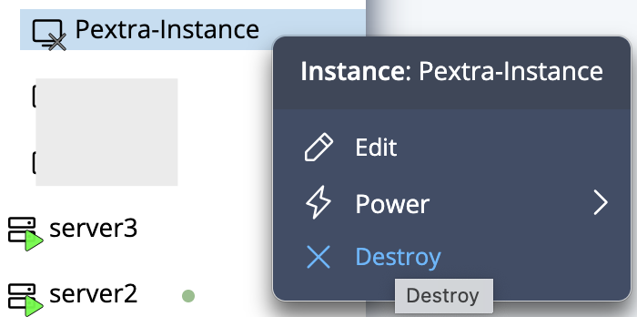
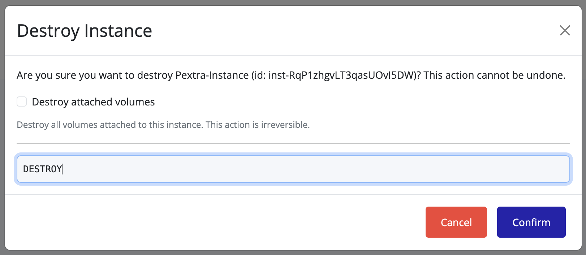

## Destroying an Instance

To permanently destroy an instance, it must first be in the **Stopped** state:

1. Ensure the instance is stopped.
2. Right-click the stopped instance.
3. Select **Destroy**.

   

4. A confirmation dialog will appear. Type the requested text in the popup and click **Confirm**.

   

5. Optionally, select the checkbox to destroy all attached volumes (storage) as well.

> [!TIP]
> An instance must be in the **Stopped** state before it can be destroyed.

> [!WARNING]
> Destroying an instance is **permanent** and cannot be undone. All data on the instance will be lost.
