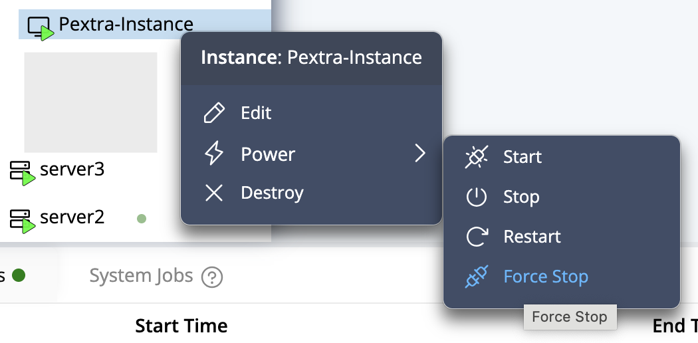
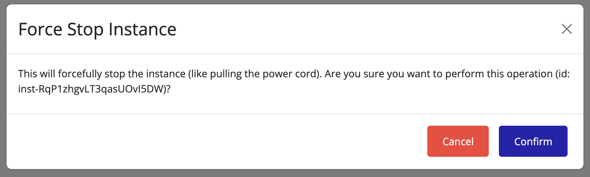

## Force Stopping an Instance

If an instance does not respond to a normal stop:

1. Right-click the unresponsive instance.
2. Select **Power → Force Stop**.

   

3. A confirmation dialog will appear. Click **Confirm**.

   

4. Wait for the instance to reach the **Stopped** state.

> [!WARNING]
> Force stopping immediately terminates all processes. Unsaved data may be lost. Use only when a normal stop fails.
