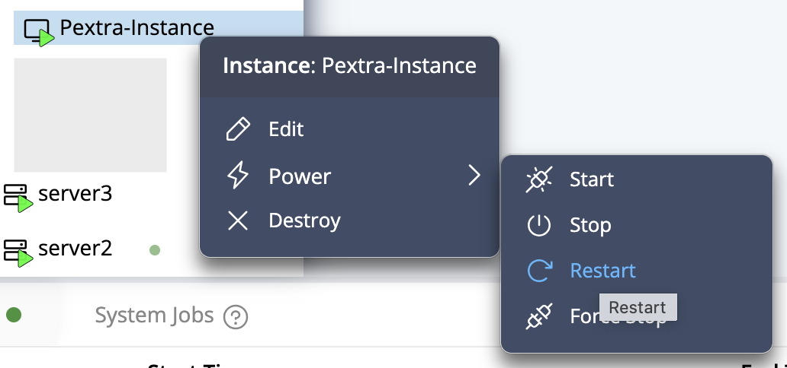
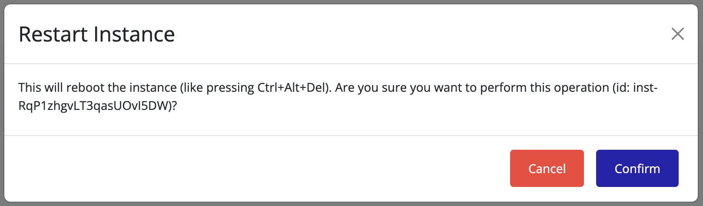

## Restarting an Instance

To reboot an instance:

1. Right-click the instance you wish to restart.
2. Select **Power → Restart**.

   

3. A confirmation dialog will appear. Click **Confirm**.

   

4. Wait for the instance to reach the **Running** state.

5. The instance will stop and start automatically. Use this option for applying configuration changes or recovering from transient issues.

> [!TIP]
> Use the **Console** tab to monitor the restart progress and ensure all services start correctly.
