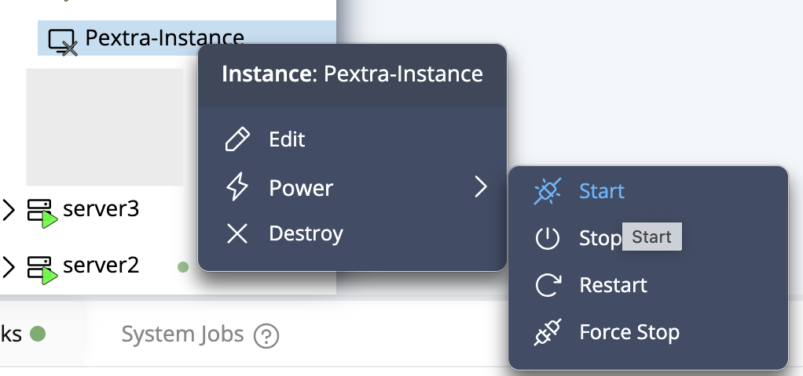
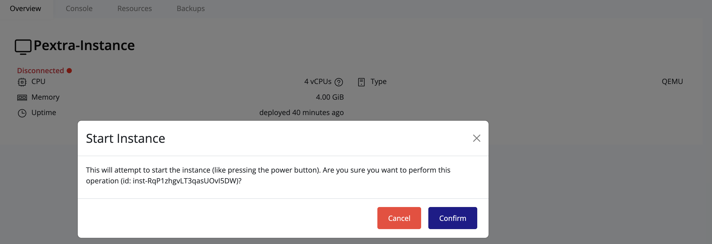

## Starting a Stopped Instance

To bring a stopped instance back online:

1. Right-click the stopped instance.
2. Select **Power → Start**.

   

3. A confirmation dialog will appear. Click **Confirm**.

   

4. Wait for the instance to reach the **Running** state.

> [!TIP]
> Use the **Console** tab to monitor boot progress and ensure all services start correctly.
