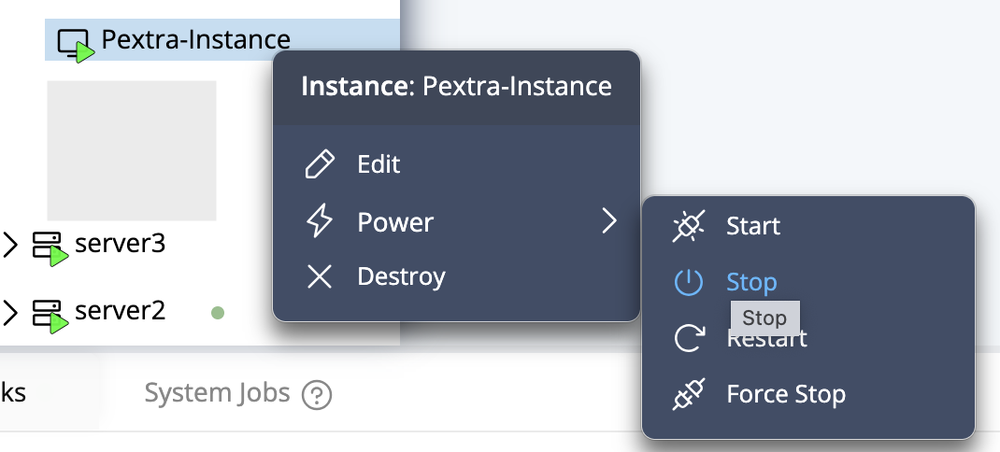
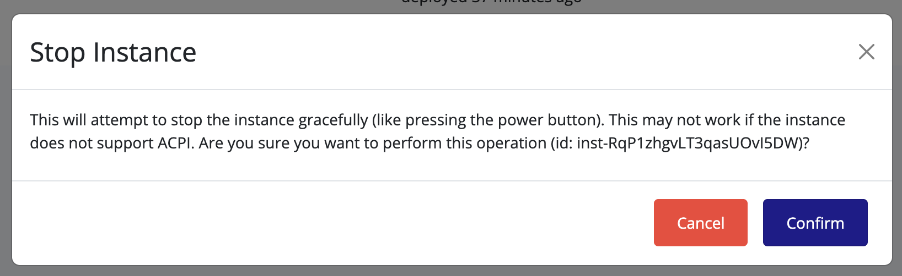

## Stopping an Instance

To gracefully stop a running instance:

1. Right-click the instance you want to stop.
2. Select **Power → Stop**.

   

3. A confirmation dialog will appear. Click **Confirm**.

   

4. Wait for the instance to reach the **Stopped** state.

> [!TIP]
> Stopping an instance shuts it down safely, allowing all processes to terminate properly. This may take a few moments depending on the workload.
