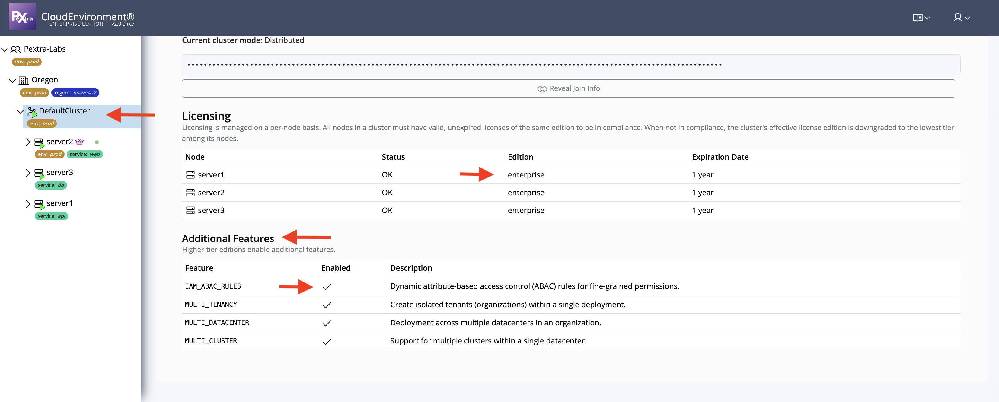

# License Features Gate

Certain features in Pextra Cloud Environment® are **exclusive to Enterprise licenses**, such as:

- Multi-tenant support (multi-organization)
- Multi-data center deployments
- Multi-cluster management

## Viewing License Features

To check the features available based on your cluster's license:

1. In the **left panel**, select the desired **cluster name**.
2. In the **right panel**, click the **Cluster** tab.

From this view, you can see the **license type for each node**. If all nodes in the cluster have an **Enterprise license**, the cluster is considered an **Enterprise cluster**. For more details, refer to [License Compliance](compliance_License_cluster.md).

The interface also shows which **Enterprise-only features are available** and whether they are currently **enabled for the selected cluster**.

> [!TIP]
> Use this view to quickly verify feature availability before deploying workloads that rely on Enterprise capabilities.
