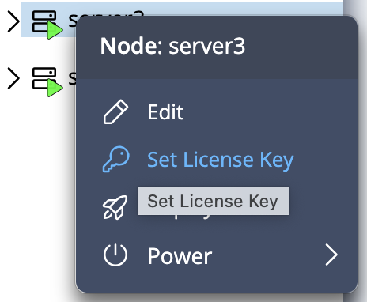
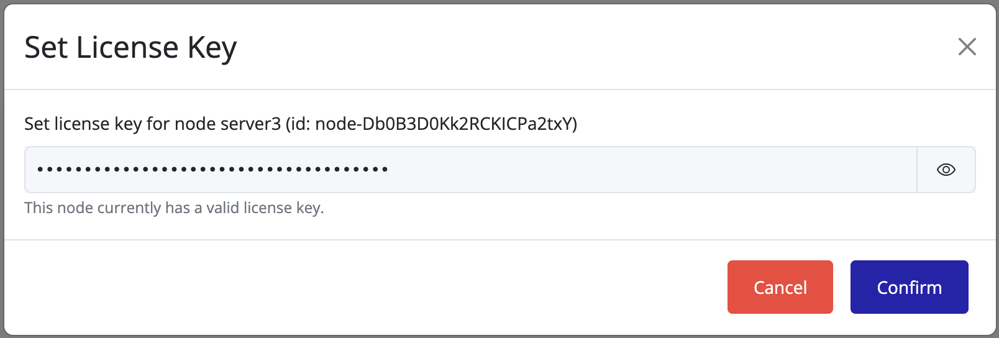

# Update License on a Node

To update or replace a license on a node:

1. Right-click on the node.
2. Select **"Select License Key"**.

An overlay screen will appear. Paste your new license key:

> [!TIP]
> Once a license is applied, it is automatically verified and set as **Active**. You can confirm the change in the **customer portal**—the license will show as used (e.g., `1/1`).

> [!NOTE]
> Licenses are **single-use per node**. Once a license is applied to a node, it **cannot be reused** on another node. Licenses also **cannot be deactivated**. Each node requires its own license key.

> [!CAUTION]
> Before using a license, especially an **Enterprise license**, make sure it is intended for the target node and environment.

> [!NOTE]
> It may take up to **15 minutes** for a new license to take effect, including any changes to the license type.

