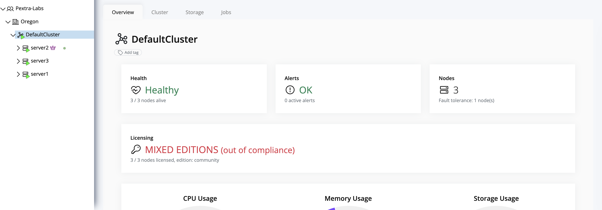

# License Compliance

All nodes in Pextra Cloud Environment® are required to maintain an **active license** at all times. License management—including subscriptions, renewals, and inventory—is handled through the **customer portal**.

> [!TIP]
> Customers are responsible for renewing licenses promptly via the customer portal to prevent service interruptions.

## Cluster Licensing Rules

To remain compliant, the following rules apply:

- Each node must have **one active license** installed.
- All nodes **within a cluster** must use the **same license category**.
- Mixing **Community** and **Enterprise** licenses within a cluster is **prohibited** and renders the cluster **non-compliant**.

If a cluster is out of compliance, the Pextra Cloud Environment® web UI will display a warning:

> [!TIP]
> Verify cluster license consistency before adding new nodes to prevent compliance warnings and potential operational issues.
