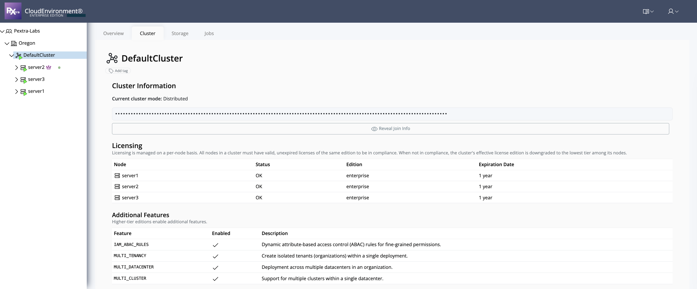

# View Available Licenses

To see the available license types for each node in a cluster:

1. From the left panel, select the **cluster** you want to inspect.
2. On the right, select the **"Cluster" tab**.
3. Scroll to the **"Licensing"** section.

Here you will see:
- Each node in the cluster
- Its assigned license type
- License status (Active/Inactive)
- Expiration date

> [!TIP]
> This view is useful for quickly checking which nodes are licensed, their status, and when licenses will expire. Keep an eye on expiration dates to avoid downtime.
