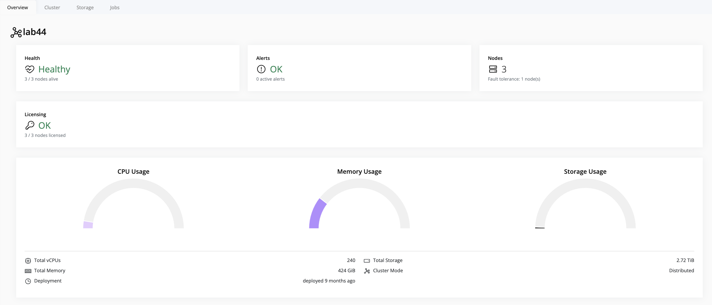
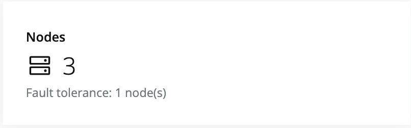
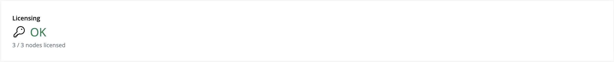
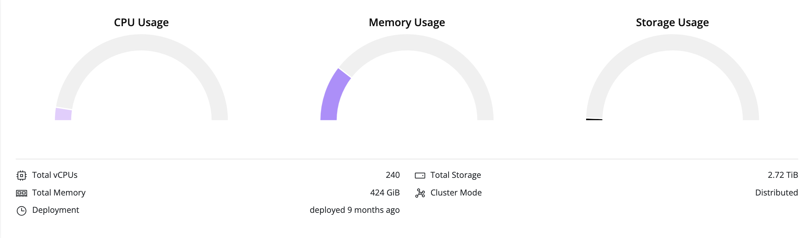

## Cluster-Level Monitoring

Cluster-level metrics provide a comprehensive overview of the entire cluster’s health, performance, and resource usage.

> [!Tip]
> To view cluster metrics, click on the **cluster** in the left navigation panel. The metrics for the selected cluster will appear on the right-hand panel.

The following metrics are available at the cluster level:

- **Cluster Health:** Displays the overall health status of the cluster.  
  
- **Number of Nodes:** Shows the total number of nodes in the cluster.  
  
- **License Status:** Displays current license status, including expiration and any issues.  
  
- **Deployment Overview:** Provides overall cluster resource usage, including CPU, memory, storage, total vCPUs, total memory, deployment duration, total storage, and cluster mode.  
  
