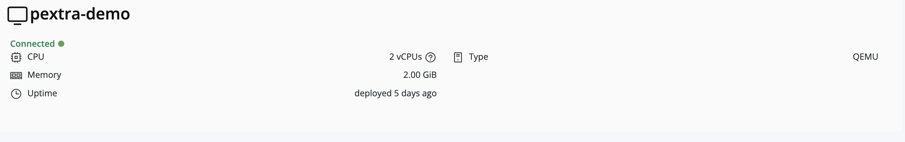

## 3. Instance-Level Monitoring

Instance-level metrics provide detailed insights into each deployed virtual machine or container.

> [!Tip] 
> To view instance metrics, click on the **instance** in the left navigation panel. The available metrics for that instance will appear on the right-hand panel.

The available instance metrics include:

- **Name:** The name of the instance.
- **Status:** Connection status—**Connected** (green) or **Disconnected** (red).
- **Memory Allocated:** Amount of memory assigned to the instance.
- **Instance Type:** Type of instance, such as **QEMU** or **LXC**.
- **Deployment Duration:** Length of time the instance has been deployed.

