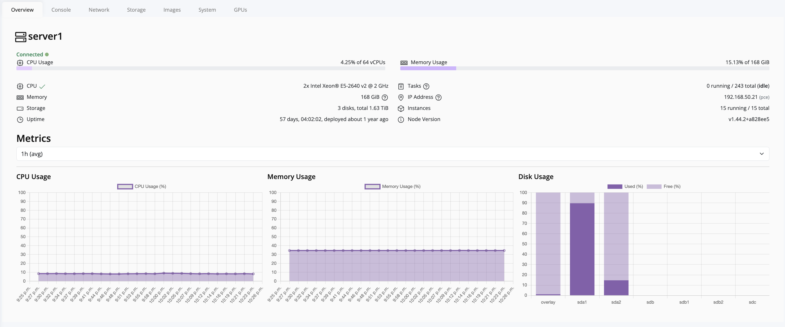
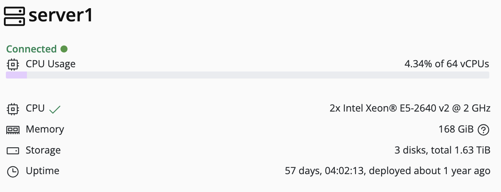
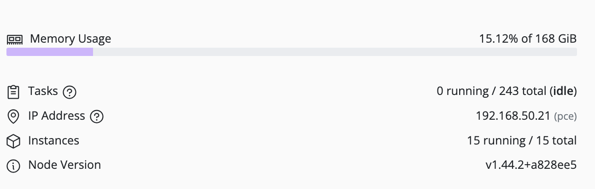
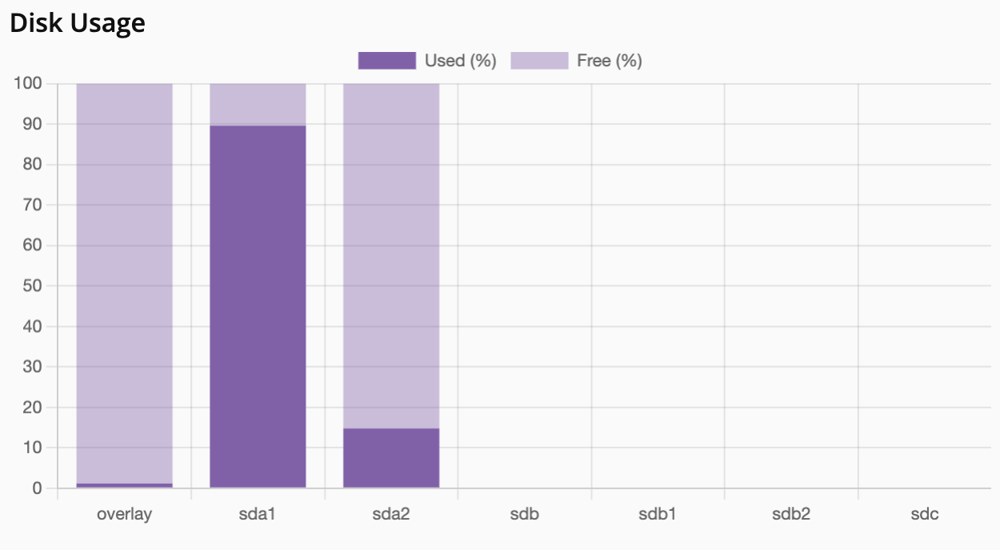

## Node-Level Monitoring

Node-level metrics provide detailed insights to help identify performance or health issues on individual nodes.

> [!Tip] 
> To view node health metrics, click on the **node** in the left navigation panel. The metrics for that node will appear on the right-hand panel.  

The following metrics are available at the node level:

- **Node Health:** Displays the overall status of the node.  
  
- **CPU Usage:** Shows real-time CPU utilization for the node.  
  
- **Memory Usage:** Monitors memory consumption per node.  
  
- **Storage Usage:** Displays storage allocation and usage for the node.  
  
