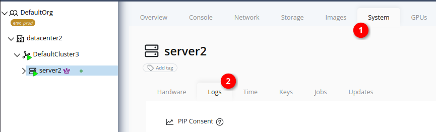
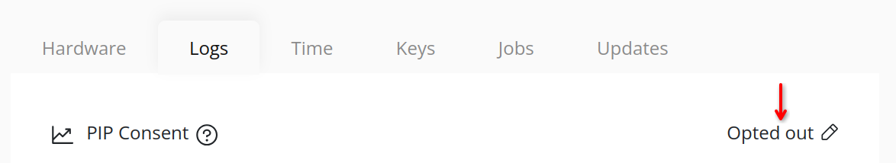
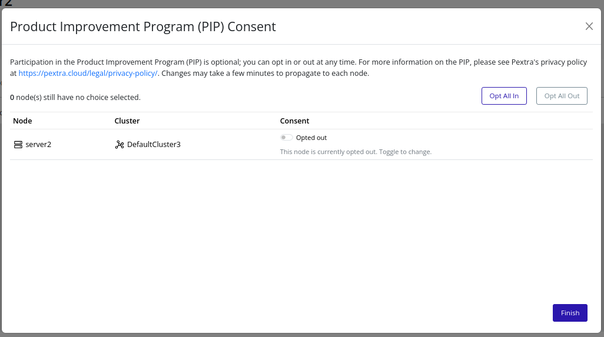
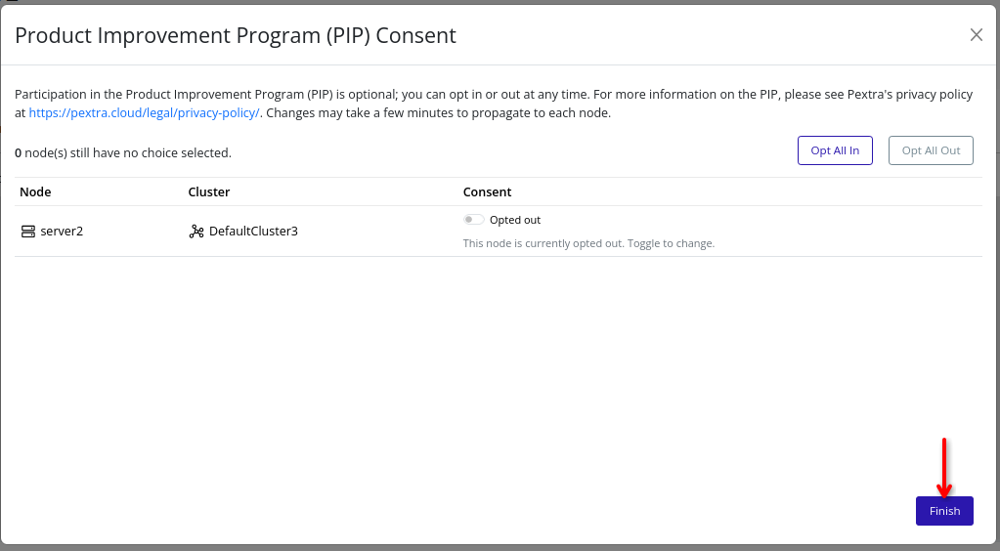

# Product Improvement Program (PIP)
The Product Improvement Program (PIP) helps us improve our products by sharing related telemetry and diagnostic data with Pextra. We use this data exclusively to improve product stability, security, and performance. You can revoke your PIP consent at any time. For more information, please refer to our [Privacy Policy](https://pextra.cloud/legal/privacy-policy/).

> [!NOTE]
> The PIP was introduced in v2.6.0. Upgrading from a version prior to v2.6.0 will result in a warning banner in the Web Interface until a consent decision is made for each node. By default, nodes with no consent decision are opted out.

> ![NOTE]
> You must have the `node.bulk_update_telemetry_consent` permission in order to edit PIP consent for nodes.

## Web Interface
1. Select the node in the resource tree and view the page on the right. Click on the **System** tab in the right pane. Then, select the **Logs** sub-tab:
   

2. The current PIP consent status is displayed in the "PIP Consent" row. To change the consent status, click the **Edit** button next to the current PIP consent status:
   

3. A modal will appear with a list of all nodes, their respective clusters, and their current PIP consent status. You can change the consent status for each node by selecting the desired option in the node's row. To change the consent status for all nodes at once, use the **Opt All In** or **Opt All Out** buttons at the top of the modal.
   

4. Click the **Finish** button to save your changes and close the modal. Changes may take a few minutes to propagate to each node.
   
