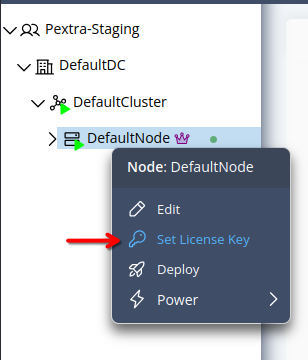
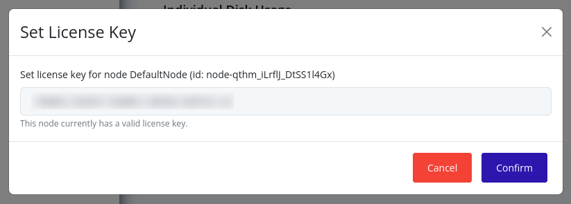
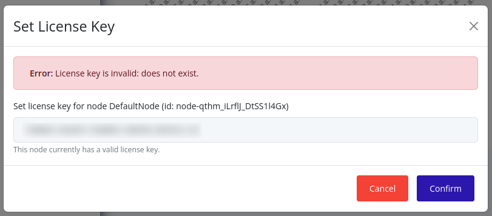

# Set License Key
License keys are long-lived and typically do not need to be changed. However, if you need to change the license key, you can do so by following these steps:

> [!TIP]
> License keys can be purchased from the [Pextra Customer Portal](https://portal.pextra.cloud). Support subscriptions are also available for purchase.

## Web Interface
1. Right-click on the node in the resource tree and select **Set License Key**:
   

2. A modal will appear. The current license key along with its validity will be displayed. Enter the new license key in the text box and click **Confirm**:
	

3. If any errors occur, they will be displayed, otherwise, the modal will close. For example:
	

To confirm that the license key has been set, you can [check the licensing status of the node's cluster](../clusters/check-licensing-status.md).
