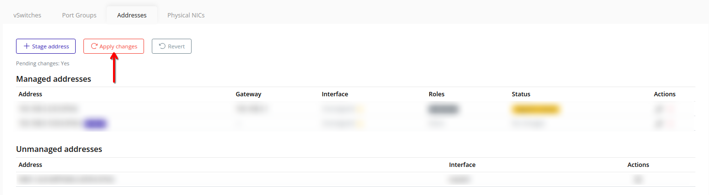
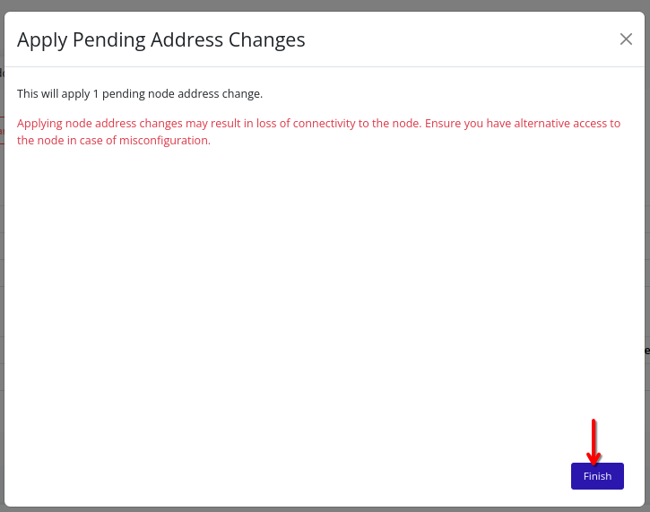

# Apply Changes
Apply pending address changes to write updated network configuration on the node. Applying changes can interrupt management connectivity.

> [!CAUTION]
> Applying changes is destructive and can break connectivity to the management interface or the cluster.

## Web Interface
1. Click **Apply changes**.
    
2. Review the confirmation dialog and click **Finish** to apply the changes.
    

3. The changes will be applied to the node. During this process, connectivity to the node may be temporarily interrupted.