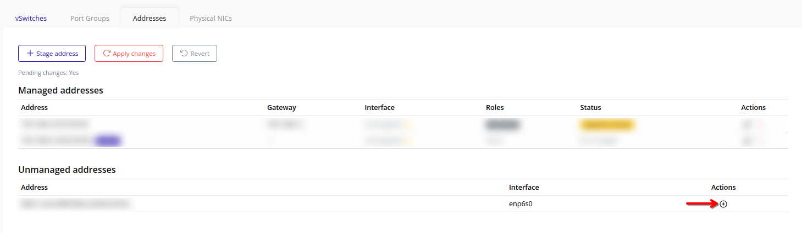
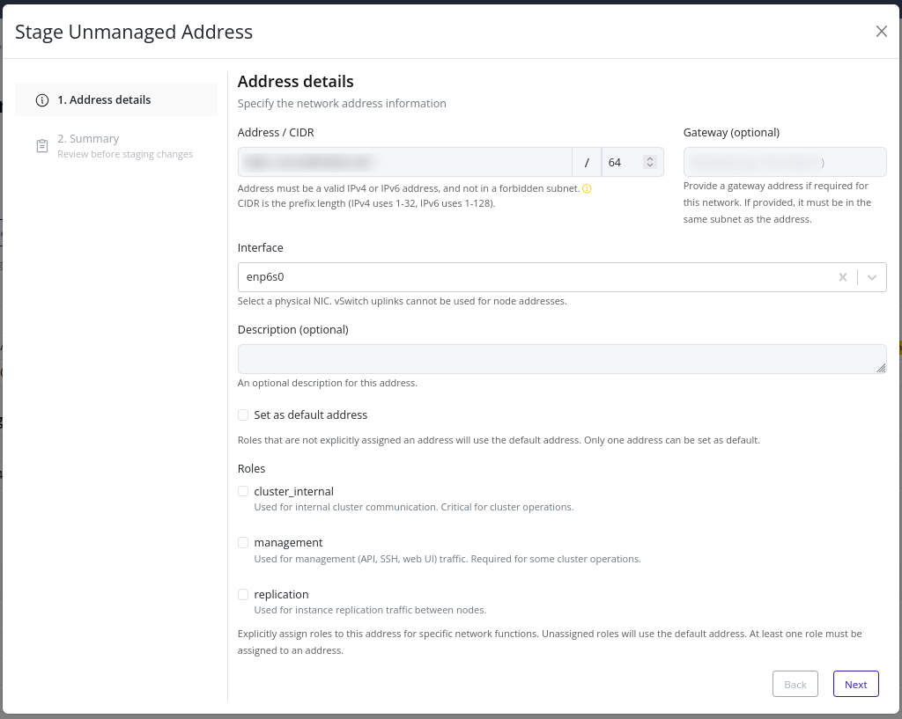
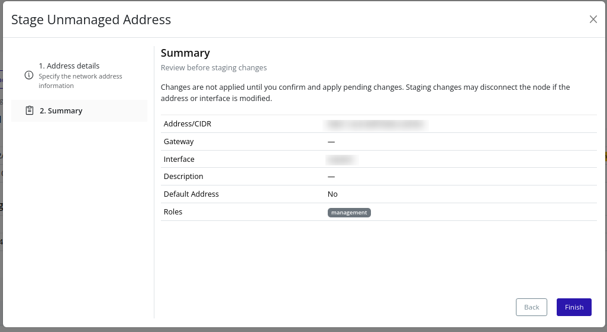

# Convert An Unmanaged Address
Convert an unmanaged address into a staged node address so it can be managed by Pextra CloudEnvironment®.

> [!NOTE]
> Only addresses already detected on the node appear in **Unmanaged addresses**.

## Web Interface
1. In **Unmanaged addresses**, click the plus icon next to the address you want to convert.
    

2. Confirm the pre-filled address, CIDR, and interface. Add a gateway if required, and select roles.
    

3. Review the summary and click **Finish** to stage the address.
    