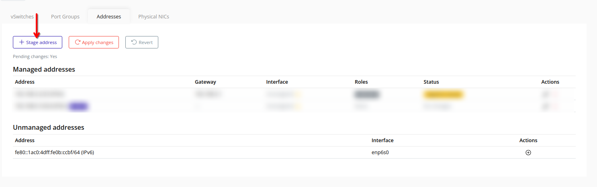
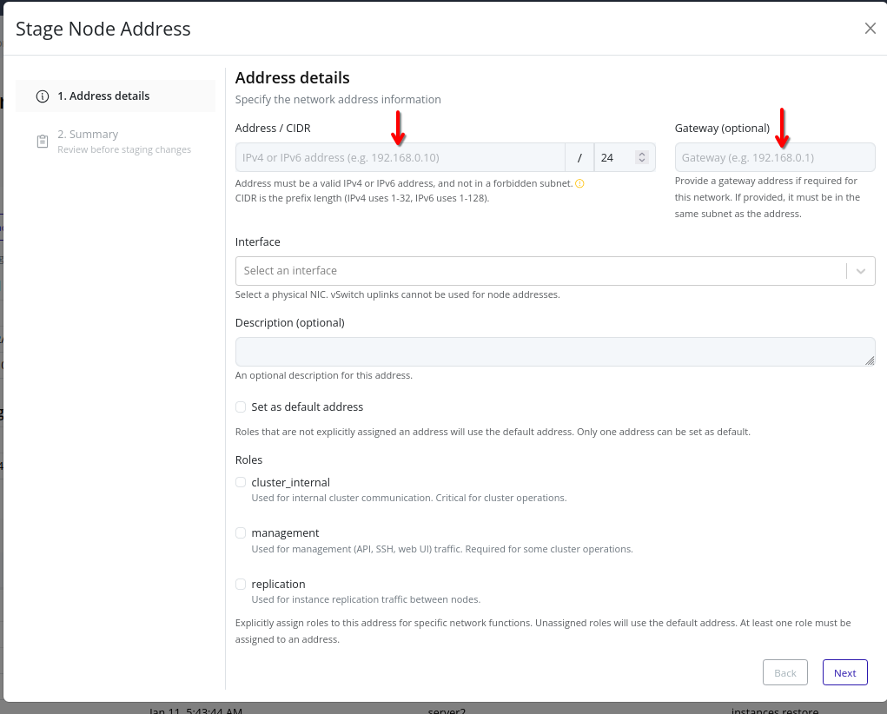
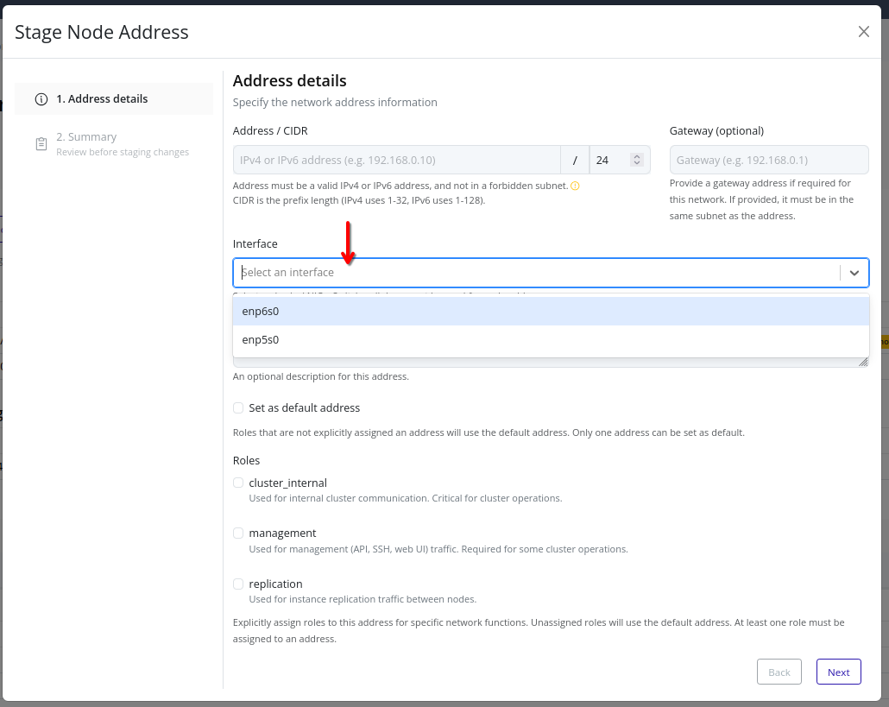
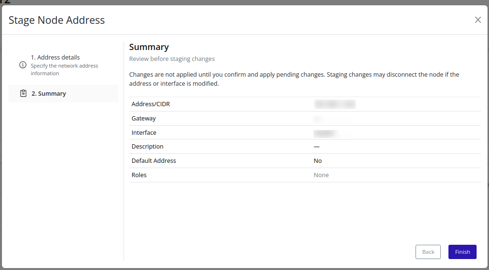

# Create (Stage) A New Address
Stage a new address on the node and assign roles before applying changes.

> [!NOTE]
> Staged addresses are pending until you [Apply Changes](./apply.md).

## Web Interface
1. Click **Stage address**.
    

2. Enter an address, CIDR, and optionally a gateway.
    

3. Select a physical NIC.
    

4. Optionally enter a description, and select at least one role. If the address will be the default for any role, enable **Set as default address**.

5. Review the summary and click **Finish** to stage the change.
    