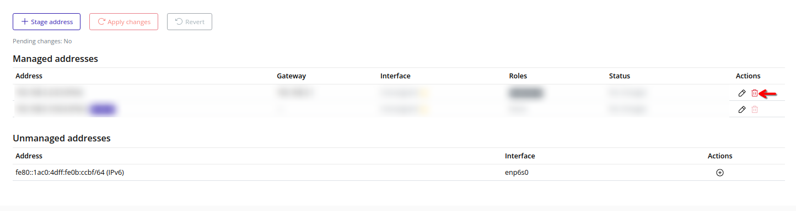
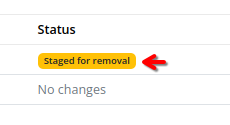

# Delete (Stage) An Address
Stage the removal of a managed address from the node. The default address cannot be removed.

> [!NOTE]
> Deleting a staged address cannot be undone. To undo deletion of an existing address, open **Stage Address Update** and click **Finish** to unstage removal.

> [!NOTE]
> Staged removals are pending until you [Apply Changes](./apply.md).

## Web Interface
1. Click the trash icon next to the address under **Managed addresses**.
    

2. Review the confirmation dialog and click **Finish** to stage the removal.
    

3. A badge "Staged for removal" will appear next to the address in the list.
    